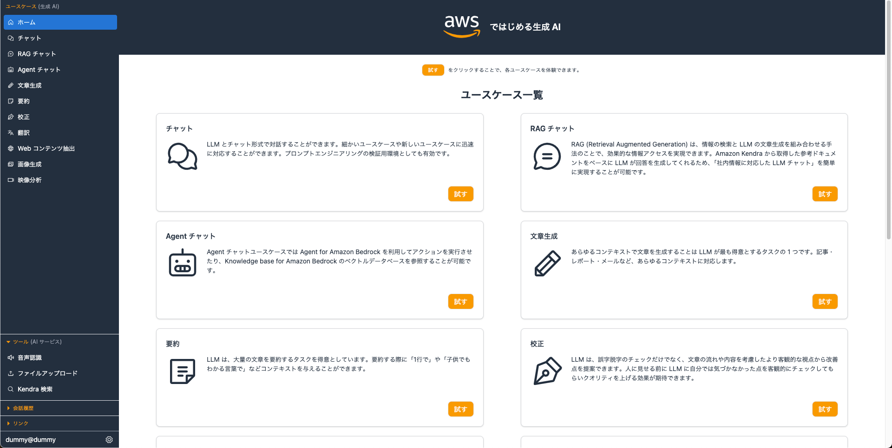
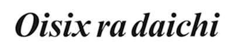

<div markdown="1" align="center">
  <h1>Generative AI Use Cases JP (略称:GenU)</h1>

  [](https://aws-samples.github.io/generative-ai-use-cases-jp/index.html) [](https://github.com/aws-samples/generative-ai-use-cases-jp/blob/main/LICENSE) [](https://github.com/aws-samples/generative-ai-use-cases-jp/actions/workflows/node.js.yml) [](https://github.com/aws-samples/generative-ai-use-cases-jp/actions/workflows/browser-extension.yml)

  生成 AI を安全に業務活用するための、ビジネスユースケース集を備えたアプリケーション実装

  
</div>

> [!IMPORTANT]
> GenU は 2025/01 に v3 にアップグレードされました。いくつかの破壊的変更を伴いますので、アップグレード前に [リリースノート](https://github.com/aws-samples/generative-ai-use-cases-jp/releases/tag/v3.0.0) をご確認ください。

## GenU 活用パターン集

GenU の機能やオプションを活用パターンごとに紹介いたします。網羅的なデプロイオプションに関しては [こちら](docs/DEPLOY_OPTION.md) をご参照ください。

> [!TIP]
> 活用パターンをクリックして詳細を確認してください

<details markdown="1">
  <summary><strong><ins>生成 AI のユースケースを体験したい</ins></strong></summary>

  GenU は生成 AI を活用した多様なユースケースを標準で提供しています。それらのユースケースは、生成 AI を業務活用するためのアイデアの種となったり、そのまま業務で活用できるものなど、さまざまです。今後もさらにブラッシュアップされたユースケースを随時追加予定です。また、不要であれば [特定のユースケースを非表示にする](docs/DEPLOY_OPTION.md#特定のユースケースを非表示にする) オプションで非表示にすることもできます。デフォルトで提供しているユースケース一覧はこちらです。

  <br/>
  <br/>
  <table width="100%">
    <thead>
      <tr>
        <td width="20%">ユースケース</td>
        <td width="80%">説明</td>
      </tr>
    </thead>
    <tbody>
      <tr>
        <td>チャット</td>
        <td>大規模言語モデル (LLM) とチャット形式で対話することができます。LLM と直接対話するプラットフォームが存在するおかげで、細かいユースケースや新しいユースケースに迅速に対応することができます。また、プロンプトエンジニアリングの検証用環境としても有効です。</td>
      </tr>
      <tr>
        <td>文章生成</td>
        <td>あらゆるコンテキストで文章を生成することは LLM が最も得意とするタスクの 1 つです。記事・レポート・メールなど、あらゆる文章を生成します。</td>
      </tr>
      <tr>
        <td>要約</td>
        <td>LLM は、大量の文章を要約するタスクを得意としています。ただ要約するだけでなく、文章をコンテキストとして与えた上で、必要な情報を対話形式で引き出すこともできます。例えば、契約書を読み込ませて「XXX の条件は？」「YYY の金額は？」といった情報を取得することが可能です。</td>
      </tr>
      <tr>
        <td>執筆</td>
        <td>LLM は、誤字脱字のチェックだけでなく、文章の流れや内容を考慮したより客観的な視点から改善点を提案できます。人に見せる前に LLM に自分では気づかなかった点を客観的にチェックしてもらいクオリティを上げる効果が期待できます。</td>
      </tr>
      <tr>
        <td>翻訳</td>
        <td>多言語で学習した LLM は、翻訳を行うことも可能です。また、ただ翻訳するだけではなく、カジュアルさ・対象層など様々な指定されたコンテキスト情報を翻訳に反映させることが可能です。</td>
      </tr>
      <tr>
        <td>Web コンテンツ抽出</td>
        <td>ブログやドキュメントなどの Web コンテンツから必要な情報を抽出します。LLMによって不要な情報を除去し、整った文章として整形します。抽出したコンテンツは要約、翻訳などの別のユースケースで利用できます。</td>
      </tr>
      <tr>
        <td>画像生成</td>
        <td>画像生成 AI は、テキストや画像を元に新しい画像を生成できます。アイデアを即座に可視化することができ、デザイン作業などの効率化を期待できます。こちらの機能では、プロンプトの作成を LLM に支援してもらうことができます。</td>
      </tr>
      <tr>
        <td>動画生成</td>
        <td>動画生成 AI はテキストから短い動画を生成します。生成した動画は素材としてさまざまなシーンで活用できます。</td>
      </tr>
      <tr>
        <td>映像分析</td>
        <td>マルチモーダルモデルによってテキストのみではなく、画像を入力することが可能になりました。こちらの機能では、映像の画像フレームとテキストを入力として LLM に分析を依頼します。</td>
      </tr>
      <tr>
        <td>ダイアグラム生成</td>
        <td>ダイアグラム生成は、あらゆるトピックに関する文章や内容を最適な図を用いて視覚化します。 テキストベースで簡単に図を生成でき、プログラマーやデザイナーでなくても効率的にフローチャートなどの図を作成できます。</td>
      </tr>
    </tbody>
  </table>
</details>

<details markdown="1">
  <summary><strong><ins>RAG がしたい</ins></strong></summary>

  RAG は LLM が苦手な最新の情報やドメイン知識を外部から伝えることで、本来なら回答できない内容にも答えられるようにする手法です。
  社内に蓄積された PDF, Word, Excel などのファイルが情報ソースになります。
  RAG は根拠に基づいた回答のみを許すため、LLM にありがちな「それっぽい間違った情報」を回答させないという効果もあります。

  GenU は RAG チャットというユースケースを提供しています。
  また RAG チャットの情報ソースとして [Amazon Kendra](docs/DEPLOY_OPTION.md) と [Knowledge Base](docs/DEPLOY_OPTION.md#rag-チャット-knowledge-base-ユースケースの有効化) の 2 種類が利用可能です。
  Amazon Kendra を利用する場合は、[手動で作成した S3 Bucket や Kendra Index をそのまま利用する](docs/DEPLOY_OPTION.md#既存の-amazon-kendra-index-を利用する場合)ことが可能です。
  Knowledge Base を利用する場合は、[Advanced Parsing](docs/DEPLOY_OPTION.md#advanced-parsing-を有効化)・[チャンク戦略の選択](docs/DEPLOY_OPTION.md#チャンク戦略を変更)・[クエリ分解](docs/DEPLOY_OPTION.md#rag-チャット-knowledge-base-ユースケースの有効化)・[リランキング](docs/DEPLOY_OPTION.md#rag-チャット-knowledge-base-ユースケースの有効化) など高度な RAG が利用可能です。
  また Knowledge Base では、[メタデータフィルターの設定](docs/DEPLOY_OPTION.md#メタデータフィルターの設定) も可能です。
  例えば「組織ごとにアクセス可能なデータソースを切り替えたい」や「UI からユーザーがフィルタを設定したい」といった要件を満たすことが可能です。
</details>

<details markdown="1">
  <summary><strong><ins>独自に作成した AI エージェントや Bedrock Flows などを社内で利用したい</ins></strong></summary>

  GenU で [エージェントを有効化](docs/DEPLOY_OPTION.md#agent-チャットユースケースの有効化)すると Web 検索エージェントと Code Interpreter エージェントが作成されます。
  Web 検索エージェントは、ユーザーの質問に回答するための情報を Web で検索し、回答します。例えば「AWS の GenU ってなに？」という質問に回答できます。
  Code Interpreter エージェントは、ユーザーからのリクエストに応えるためにコードが実行できます。例えば「適当なダミーデータで散布図を描いて」といったリクエストに応えられます。

  Web 検索エージェントと Code Interpreter エージェントはエージェントとしては基本的なものですので、中にはもっと業務に寄り添った実践的なエージェントを使いたいという要望もあると思います。
  GenU では手動で作成したエージェントや別のアセットで作成したエージェントを [インポートする機能](docs/DEPLOY_OPTION.md#手動で作成した-agent-を追加) を提供しております。

  GenU をエージェント活用のプラットフォームとして利用することで、GenU が提供する [豊富なセキュリティオプション](docs/DEPLOY_OPTION.md#セキュリティ関連設定) や [SAML認証](docs/DEPLOY_OPTION.md#saml-認証) などを活用し、実践的なエージェントを社内に普及させることができます。
  また、オプションで [不要な標準ユースケースを非表示](docs/DEPLOY_OPTION.md#特定のユースケースを非表示にする) にしたり、[エージェントをインライン表示](docs/DEPLOY_OPTION.md#agent-をインライン表示にする) することで、よりエージェントに特化したプラットフォームとして GenU をご利用いただくことが可能です。

  Bedrock Flows に関しても同様に [インポート機能](docs/DEPLOY_OPTION.md#flow-チャットユースケースの有効化) がございますので、ぜひご活用ください。
</details>

<details markdown="1">
  <summary><strong><ins>独自のユースケースを作成したい</ins></strong></summary>

  GenU はプロンプトテンプレートを自然言語で記述することで独自のユースケースを作成できる「ユースケースビルダー」という機能を提供しています。
  プロンプトテンプレートだけで独自のユースケース画面が自動生成されるため、GenU 本体のコード変更は一切不要です。
  作成したユースケースは、個人利用だけではなく、アプリケーションにログインできる全ユーザーに共有することもできます。
  ユースケースビルダーは不要であれば[無効化](docs/DEPLOY_OPTION.md#ユースケースビルダーの設定)することも可能です。
  ユースケースビルダーについての詳細は、ぜひ<a href="https://aws.amazon.com/jp/blogs/news/genu-use-cases-builder/">こちらのブログ</a>をご覧ください。
  <br/>
  <br/>
  ユースケースビルダーではフォームにテキストを入力したりファイルを添付するユースケースが作成できますが、要件によってはチャットの UI が良い場合もあると思います。
  そのようなケースでは「チャット」ユースケースのシステムプロンプト保存機能をご活用ください。
  システムプロンプトを保存しておくことで、ワンクリックで業務に必要な "ボット" が作成できます。
  例えば「ソースコードを入力するとひたすらレビューしてくれるボット」や「入力した内容からひたすらメールアドレスを抽出してくれるボット」などが作成できます。
  また、チャットの会話履歴はログインユーザーにシェアすることが可能で、シェアされた会話履歴からシステムプロンプトをインポートすることもできます。
  <br/>
  <br/>
  GenU は OSS ですので、カスタマイズして独自のユースケースを追加するということも可能です。
  その場合は GenU の main ブランチとのコンフリクトにお気をつけてください。
</details>

## デプロイ

> [!IMPORTANT]
> [`/packages/cdk/cdk.json`](/packages/cdk/cdk.json) に記載されている `modelRegion` リージョンの `modelIds` (テキスト生成) 及び `imageGenerationModelIds` (画像生成) を有効化してください。([Amazon Bedrock の Model access 画面](https://us-east-1.console.aws.amazon.com/bedrock/home?region=us-east-1#/modelaccess))

GenU のデプロイには [AWS Cloud Development Kit](https://aws.amazon.com/jp/cdk/)（以降 CDK）を利用します。CDK の実行環境が用意できない場合は、以下のデプロイ方法を参照してください。
- [AWS CloudShell を利用したデプロイ方法 (手元の環境を用意することが難しい場合)](docs/DEPLOY_ON_CLOUDSHELL.md)
- [Workshop](https://catalog.workshops.aws/generative-ai-use-cases-jp)

まず、以下のコマンドを実行してください。全てのコマンドはリポジトリのルートで実行してください。

```bash
npm ci
```

CDK を利用したことがない場合、初回のみ [Bootstrap](https://docs.aws.amazon.com/ja_jp/cdk/v2/guide/bootstrapping.html) 作業が必要です。すでに Bootstrap された環境では以下のコマンドは不要です。

```bash
npx -w packages/cdk cdk bootstrap
```

続いて、以下のコマンドで AWS リソースをデプロイします。デプロイが完了するまで、お待ちください（20 分程度かかる場合があります）。

```bash
# 通常デプロイ
npm run cdk:deploy

# 高速デプロイ (作成されるリソースを事前確認せずに素早くデプロイ)
npm run cdk:deploy:quick
```

## アーキテクチャ


## その他

 - [デプロイオプション](docs/DEPLOY_OPTION.md)
 - [アップデート方法](docs/UPDATE.md)
 - [ローカル開発環境構築手順](docs/DEVELOPMENT.md)
 - [リソースの削除方法](docs/DESTROY.md)
 - [ネイティブアプリのように利用する方法](docs/PWA.md)
 - [ブラウザ拡張機能を利用する](docs/EXTENSION.md)

## 料金試算

GenU をご利用いただく際の、構成と料金試算例を公開しております。(従量課金制となっており、実際の料金はご利用内容により変動いたします。)

- [シンプル版 (RAG なし) 試算](https://aws.amazon.com/jp/cdp/ai-chatbot/)
- [RAG (Amazon Kendra) あり試算](https://aws.amazon.com/jp/cdp/ai-chatapp/)
- [RAG (Knowledge Base) あり試算](https://aws.amazon.com/jp/cdp/genai-chat-app/)

## お客様事例

| Customer | Quote |
|:--------|:---------|
| <a href="https://www.yasashiite.com/" target="_blank"></a> | **株式会社やさしい手** <br/> *GenU のおかげで、利用者への付加価値提供と従業員の業務効率向上が実現できました。従業員にとって「いままでの仕事」が楽しい仕事に変化していく「サクサクからワクワクへ」更に進化を続けます！* <br/> ・[事例の詳細を見る](./docs/assets/images/cases/yasashiite_case.png) <br/> ・[事例のページを見る](https://aws.amazon.com/jp/solutions/case-studies/yasashii-te/)|
| <a href="https://www.takihyo.co.jp/" target="_blank"></a> | **タキヒヨー株式会社** <br/> *生成 AI を活用し社内業務効率化と 450 時間超の工数削減を実現。Amazon Bedrock を衣服デザイン等に適用、デジタル人材育成を推進。* <br/> ・[事例のページを見る](https://aws.amazon.com/jp/solutions/case-studies/takihyo/)|
| <a href="https://salsonido.com/" target="_blank"></a>| **株式会社サルソニード** <br/> *ソリューションとして用意されている GenU を活用することで、生成 AI による業務プロセスの改善に素早く取り掛かることができました。* <br/> ・[事例の詳細を見る](./docs/assets/images/cases/salsonido_case.png) <br/> ・[適用サービス](https://kirei.ai/)|
| <a href="https://www.tamura-ss.co.jp/jp/index.html" target="_blank"></a> | **株式会社タムラ製作所** <br/> *AWS が Github に公開しているアプリケーションサンプルは即テスト可能な機能が豊富で、そのまま利用することで自分たちにあった機能の選定が難なくでき、最終システムの開発時間を短縮することができました。*<br/> ・[事例の詳細を見る](./docs/assets/images/cases/tamura-ss_case.png)<br/> |
| <a href="https://jdsc.ai/" target="_blank"></a> | **株式会社JDSC** <br/> *Amazon Bedrock ではセキュアにデータを用い LLM が活用できます。また、用途により最適なモデルを切り替えて利用できるので、コストを抑えながら速度・精度を高めることができました。* <br/> ・[事例の詳細を見る](./docs/assets/images/cases/jdsc_case.png) |
| <a href="https://www.iret.co.jp/" target="_blank"></a>|  **アイレット株式会社** <br/> *株式会社バンダイナムコアミューズメントの生成 AI 活用に向けて社内のナレッジを蓄積・体系化すべく、AWS が提供している Generative AI Use Cases JP を活用したユースケースサイトを開発。アイレット株式会社が本プロジェクトの設計・構築・開発を支援。* <br/> ・[株式会社バンダイナムコアミューズメント様のクラウドを活用した導入事例](https://cloudpack.jp/casestudy/302.html?_gl=1*17hkazh*_gcl_au*ODA5MDk3NzI0LjE3MTM0MTQ2MDU) |
| <a href="https://idealog.co.jp" target="_blank"></a>|  **株式会社アイデアログ** <br/> *M従来の生成 AI ツールよりもさらに業務効率化ができていると感じます。入出力データをモデルの学習に使わない Amazon Bedrock を使っているので、セキュリティ面も安心です。* <br/> ・[事例の詳細を見る](./docs/assets/images/cases/idealog_case.png) <br/> ・[適用サービス](https://kaijosearch.com/)|
| <a href="https://estyle.co.jp/" target="_blank"></a>|  **株式会社エスタイル** <br/> *GenU を活用して短期間で生成 AI 環境を構築し、社内のナレッジシェアを促進することができました。* <br/> ・[事例の詳細を見る](./docs/assets/images/cases/estyle_case.png) |
| <a href="https://meidensha.co.jp/" target="_blank"></a>|  **株式会社明電舎** <br/> *Amazon Bedrock や Amazon Kendra など AWS のサービスを利用することで、生成 AI の利用環境を迅速かつセキュアに構築することができました。議事録の自動生成や社内情報の検索など、従業員の業務効率化に貢献しています。* <br/> ・[事例の詳細を見る](./docs/assets/images/cases/meidensha_case.png) |
| <a href="https://www.st-grp.co.jp/" target="_blank"></a>|  **三協立山株式会社** <br/> *社内に埋もれていた情報が Amazon Kendra の活用で素早く探せるようになりました。GenU を参考にすることで求めていた議事録生成などの機能を迅速に提供できました。* <br/> ・[事例の詳細を見る](./docs/assets/images/cases/st-grp_case.png) |
| <a href="https://www.oisixradaichi.co.jp/" target="_blank"></a>|  **オイシックス・ラ・大地株式会社** <br/> *GenU を活用したユースケースの開発プロジェクトを通して、必要なリソース、プロジェクト体制、外部からの支援、人材育成などを把握するきっかけとなり、生成 AI の社内展開に向けたイメージを明確につかむことができました。* <br/> ・[事例のページを見る](https://aws.amazon.com/jp/solutions/case-studies/oisix/) |
| <a href="https://www.san-a.co.jp/" target="_blank"></a>|  **株式会社サンエー** <br/> *Amazon Bedrock を活用することでエンジニアの生産性が劇的に向上し、内製で構築してきた当社特有の環境のクラウドへの移行を加速できました。* <br/> ・[事例の詳細を見る](./docs/assets/images/cases/san-a_case.png)<br/> ・[事例のページを見る](https://aws.amazon.com/jp/solutions/case-studies/san-a/) |

活用事例を掲載させて頂ける場合は、[Issue](https://github.com/aws-samples/generative-ai-use-cases-jp/issues)よりご連絡ください。

## 参照
 - [ブログ: 生成 AI アプリをノーコードで作成・社内配布できる GenU ユースケースビルダー](https://aws.amazon.com/jp/blogs/news/genu-use-cases-builder/)
 - [ブログ: RAG プロジェクトを成功させる方法 #1 ~ あるいは早く失敗しておく方法 ~](https://aws.amazon.com/jp/builders-flash/202502/way-to-succeed-rag-project/)
 - [ブログ: RAG チャットで精度向上のためのデバッグ方法](https://qiita.com/sugimount-a/items/7ed3c5fc1eb867e28566)
 - [ブログ: Amazon Q Developer CLI を利用してノーコーディングで GenU をカスタマイズ](https://qiita.com/wadabee/items/659e189018ad1a08e152)
 - [ブログ: Generative AI Use Cases JP をカスタマイズする方法](https://aws.amazon.com/jp/blogs/news/how-to-generative-ai-use-cases-jp/)
 - [ブログ: 無茶振りは生成 AI に断ってもらおう ~ ブラウザに生成 AI を組み込んでみた ~](https://aws.amazon.com/jp/builders-flash/202405/genai-sorry-message/)
 - [ブログ: Amazon Bedrock で Interpreter を開発!](https://aws.amazon.com/jp/builders-flash/202311/bedrock-interpreter/)
 - [動画: 生成 AI ユースケースを考え倒すための Generative AI Use Cases JP (GenU) の魅力と使い方](https://www.youtube.com/live/s1P5A2SIWgc?si=PBQ4ZHQXU4pDhL8A)

## Security

See [CONTRIBUTING](/CONTRIBUTING.md#security-issue-notifications) for more information.

## License

This library is licensed under the MIT-0 License. See the LICENSE file.
