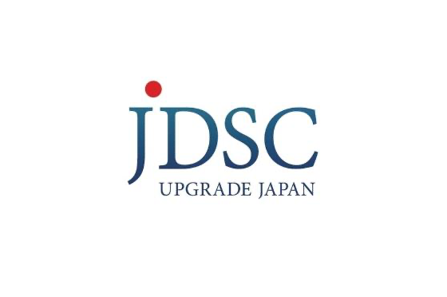

> [!IMPORTANT]
> This repository is currently developed for Japanese users. If you wish for multilingual support, please react to [this issue](https://github.com/aws-samples/generative-ai-use-cases-jp/issues/151).

# Generative AI Use Cases JP (略称:GenU)

Generative AI（生成 AI）は、ビジネスの変革に革新的な可能性をもたらします。GenU は、生成 AI を安全に業務活用するための、ビジネスユースケース集を備えたアプリケーション実装です。


このリポジトリではブラウザ拡張機能も提供しており、より便利に 生成 AI を活用することができます。詳しくは[こちらのページ](/browser-extension/README.md)をご覧ください。

> **生成AIの進化に伴い、破壊的な変更を加えることが多々あります。エラーが発生した際は、まず最初にmainブランチの更新がないかご確認ください。**

## ユースケース一覧

> ユースケースは随時追加予定です。ご要望があれば [Issue](https://github.com/aws-samples/generative-ai-use-cases-jp/issues) に起票をお願いいたします。

<details>
  <summary>チャット</summary>

  大規模言語モデル (LLM) とチャット形式で対話することができます。LLM と直接対話するプラットフォームが存在するおかげで、細かいユースケースや新しいユースケースに迅速に対応することができます。また、プロンプトエンジニアリングの検証用環境としても有効です。

  
</details>

<details>
   <summary>RAG チャット</summary>

  RAG は LLM が苦手な最新の情報やドメイン知識を外部から伝えることで、本来なら回答できない内容にも答えられるようにする手法です。それと同時に、根拠に基づいた回答のみを許すため、LLM にありがちな「それっぽい間違った情報」を回答させないという効果もあります。例えば、社内ドキュメントを LLM に渡せば、社内の問い合わせ対応が自動化できます。このリポジトリでは Amazon Kendra か Knowledge Base から情報を取得します。

  
</details>

<details>
   <summary>Agent チャット</summary>

  Agent は LLM を API と連携することでさまざまなタスクを行えるようにする手法です。このソリューションではサンプル実装として検索エンジンを利用し必要な情報を調査して回答する Agent を実装しています。

  
</details>

<details>
   <summary>Prompt Flow チャット</summary>

  Amazon Bedrock Prompt Flowsにより、プロンプト、基盤モデル、および他のAWSサービスを接続することでワークフローを作成できます。Prompt Flow チャットユースケースでは、作成済みの Flow を選択して実行するチャットが利用できます。

  
</details>

<details>
   <summary>文章生成</summary>

   あらゆるコンテキストで文章を生成することは LLM が最も得意とするタスクの 1 つです。記事・レポート・メールなど、あらゆるコンテキストに対応します。

  
</details>

<details>
  <summary>要約</summary>

  LLM は、大量の文章を要約するタスクを得意としています。ただ要約するだけでなく、文章をコンテキストとして与えた上で、必要な情報を対話形式で引き出すこともできます。例えば、契約書を読み込ませて「XXX の条件は？」「YYY の金額は？」といった情報を取得することが可能です。

  
</details>

<details>
  <summary>校正</summary>

  LLM は、誤字脱字のチェックだけでなく、文章の流れや内容を考慮したより客観的な視点から改善点を提案できます。人に見せる前に LLM に自分では気づかなかった点を客観的にチェックしてもらいクオリティを上げる効果が期待できます。

  
</details>

<details>
  <summary>翻訳</summary>

  多言語で学習した LLM は、翻訳を行うことも可能です。また、ただ翻訳するだけではなく、カジュアルさ・対象層など様々な指定されたコンテキスト情報を翻訳に反映させることが可能です。

  
</details>

<details>
  <summary>Web コンテンツ抽出</summary>

  ブログやドキュメントなどの Web コンテンツを抽出します。LLM によって不要な情報はそぎ落とし、成立した文章として整形します。抽出したコンテンツは要約、翻訳などの別のユースケースで利用できます。

  
</details>


<details>
  <summary>画像生成</summary>

  画像生成 AI は、テキストや画像を元に新しい画像を生成できます。アイデアを即座に可視化することができ、デザイン作業などの効率化を期待できます。こちらの機能では、プロンプトの作成を LLM に支援してもらうことができます。

  
</details>


<details>
  <summary>映像分析</summary>

  マルチモーダルモデルによってテキストのみではなく、画像を入力することが可能になりました。こちらの機能では、映像の画像フレームとテキストを入力として LLM に分析を依頼します。

  
</details>

## ユースケースビルダー

ユースケースビルダーは、プロンプトテンプレートを自然言語で記述することで独自のユースケースを作成できる機能です。プロンプトテンプレートだけで独自のユースケース画面が自動生成されるため、**コード変更・カスタマイズ作業が一切不要**です。作成したユースケースは、個人利用だけではなく、アプリケーションにログインできる全ユーザーに共有することもできます。ユースケースビルダーを無効化する場合は、[ユースケースビルダーの設定](./docs/DEPLOY_OPTION.md#ユースケースビルダーの設定)を参照してください。

## アーキテクチャ

この実装では、フロントエンドに React を採用し、静的ファイルは Amazon CloudFront + Amazon S3 によって配信されています。バックエンドには Amazon API Gateway + AWS Lambda、認証には Amazon Cognito を使用しています。また、LLM は Amazon Bedrock を使用します。RAG のデータソースには Amazon Kendra を利用しています。


## デプロイ

> [!IMPORTANT]
> このリポジトリでは、デフォルトのモデルとしてバージニア北部リージョン (us-east-1) の Anthropic Claude 3 Sonnet (テキスト生成)と、Stability AI の SDXL 1.0(画像生成) を利用する設定になっています。[Model access 画面 (us-east-1)](https://us-east-1.console.aws.amazon.com/bedrock/home?region=us-east-1#/modelaccess)を開き、Anthropic Claude 3 Sonnet にチェックして Save changes してください。その他のモデル (Anthropic Claude 3 Haiku, Meta Llama3, Cohere Command-R など) を利用するために設定を変更する方法については [Amazon Bedrock のモデルを変更する](/docs/DEPLOY_OPTION.md#amazon-bedrock-のモデルを変更する) を参照してください。

GenU のデプロイには [AWS Cloud Development Kit](https://aws.amazon.com/jp/cdk/)（以降 CDK）を利用します。Step-by-Step の解説、あるいは、別のデプロイ手段を利用する場合は以下を参照してください。
- [Workshop](https://catalog.workshops.aws/generative-ai-use-cases-jp)
- [AWS CloudShell を利用したデプロイ方法 (手元の環境を用意することが難しい場合)](/docs/DEPLOY_ON_CLOUDSHELL.md)
- [動画によるデプロイ手順の紹介](https://www.youtube.com/watch?v=9sMA17OKP1k)

まず、以下のコマンドを実行してください。全てのコマンドはリポジトリのルートで実行してください。

```bash
npm ci
```

CDK を利用したことがない場合、初回のみ [Bootstrap](https://docs.aws.amazon.com/ja_jp/cdk/v2/guide/bootstrapping.html) 作業が必要です。すでに Bootstrap された環境では以下のコマンドは不要です。

```bash
npx -w packages/cdk cdk bootstrap
```

続いて、以下のコマンドで AWS リソースをデプロイします。デプロイが完了するまで、お待ちください（20 分程度かかる場合があります）。

```bash
npm run cdk:deploy
```

## [デプロイオプション](/docs/DEPLOY_OPTION.md)
- [設定方法](/docs/DEPLOY_OPTION.md#設定方法)
  - [cdk.json の値を変更する方法](/docs/DEPLOY_OPTION.md#cdkjson-の値を変更する方法)
- [ユースケースの設定](/docs/DEPLOY_OPTION.md#ユースケースの設定)
  - [RAG チャット (Amazon Kendra) ユースケースの有効化](/docs/DEPLOY_OPTION.md#rag-チャット-amazon-kendra-ユースケースの有効化)
    - [既存の Amazon Kendra Index を利用したい場合](/docs/DEPLOY_OPTION.md#既存の-amazon-kendra-index-を利用したい場合)
  - [RAG チャット (Knowledge Base) ユースケースの有効化](/docs/DEPLOY_OPTION.md#rag-チャット-knowledge-base-ユースケースの有効化)
    - [Advanced Parsing を有効化](/docs/DEPLOY_OPTION.md#Advanced-Parsing-を有効化)
    - [チャンク戦略を変更](/docs/DEPLOY_OPTION.md#チャンク戦略を変更)
    - [Knowledge Base や OpenSearch Service を変更](/docs/DEPLOY_OPTION.md#Knowledge-Base-や-OpenSearch-Service-を再作成して変更を加える)
  - [Agent チャットユースケースの有効化](/docs/DEPLOY_OPTION.md#agent-チャットユースケースの有効化)
    - [Code Interpreter 機能を持つエージェントのデプロイ](/docs/DEPLOY_OPTION.md#Code-Interpreter-エージェントのデプロイ)
    - [検索エージェントのデプロイ](/docs/DEPLOY_OPTION.md#検索エージェントのデプロイ)
    - [Knowledge Bases for Amazon Bedrock エージェントのデプロイ](/docs/DEPLOY_OPTION.md#knowledge-bases-for-amazon-bedrock-エージェントのデプロイ)
  - [PromptFlow チャットユースケースの有効化](/docs/DEPLOY_OPTION.md#promptflow-チャットユースケースの有効化)
  - [映像分析ユースケースの有効化](/docs/DEPLOY_OPTION.md#映像分析ユースケースの有効化)
  - [プロンプト最適化ツールの有効化](/docs/DEPLOY_OPTION.md#プロンプト最適化ツールの有効化)
- [ユースケースビルダーの有効化](/docs/DEPLOY_OPTION.md#ユースケースビルダーの有効化)
- [Amazon Bedrock のモデルを変更する](/docs/DEPLOY_OPTION.md#amazon-bedrock-のモデルを変更する)
  - [us-east-1 (バージニア) の Amazon Bedrock のモデルを利用する例](/docs/DEPLOY_OPTION.md#us-east-1-バージニア-の-amazon-bedrock-のモデルを利用する例)
  - [us-west-2 (オレゴン) の Amazon Bedrock のモデルを利用する例](/docs/DEPLOY_OPTION.md#us-west-2-オレゴン-の-amazon-bedrock-のモデルを利用する例)
  - [cross-region inference が対応しているモデルで us(北部バージニアもしくはオレゴン) の Amazon Bedrock のモデルを利用する場合](/docs/DEPLOY_OPTION.md#cross-region-inference-が対応しているモデルで-us北部バージニアもしくはオレゴン-の-amazon-bedrock-のモデルを利用する場合)
  - [ap-northeast-1 (東京) の Amazon Bedrock のモデルを利用する例](/docs/DEPLOY_OPTION.md#ap-northeast-1-東京-の-amazon-bedrock-のモデルを利用する例)
- [Amazon SageMaker のカスタムモデルを利用したい場合](/docs/DEPLOY_OPTION.md#amazon-sagemaker-のカスタムモデルを利用したい場合)
  - [デプロイしたモデルを GenU から呼び出す設定](/docs/DEPLOY_OPTION.md#デプロイしたモデルを-genu-から呼び出す設定)
- [セキュリティ関連設定](/docs/DEPLOY_OPTION.md#セキュリティ関連設定)
  - [セルフサインアップを無効化する](/docs/DEPLOY_OPTION.md#セルフサインアップを無効化する)
  - [サインアップできるメールアドレスのドメインを制限する](/docs/DEPLOY_OPTION.md#サインアップできるメールアドレスのドメインを制限する)
  - [AWS WAF による制限を有効化する](/docs/DEPLOY_OPTION.md#aws-waf-による制限を有効化する)
    - [IP 制限](/docs/DEPLOY_OPTION.md#IP-アドレスによる制限)
    - [地理的制限](/docs/DEPLOY_OPTION.md#地理的制限)
  - [SAML 認証](/docs/DEPLOY_OPTION.md#SAML-認証)
  - [ガードレール](/docs/DEPLOY_OPTION.md#ガードレール)
- [コスト関連設定](/docs/DEPLOY_OPTION.md#コスト関連設定)
  - [Kendraのインデックスを自動で作成・削除するスケジュールを設定する](/docs/DEPLOY_OPTION.md#Kendraを自動でオン・オフするスケジュールを設定する)
- [モニタリング用のダッシュボードの有効化](/docs/DEPLOY_OPTION.md#モニタリング用のダッシュボードの有効化)
- [別 AWS アカウントの Bedrock を利用したい場合](/docs/DEPLOY_OPTION.md#別-AWS-アカウントの-Bedrock-を利用したい場合)

## その他
 - [アップデート方法](/docs/UPDATE.md)
 - [ローカル開発環境構築手順](/docs/DEVELOPMENT.md)
 - [リソースの削除方法](/docs/DESTROY.md)
 - [ネイティブアプリのように利用する方法](/docs/PWA.md)
 - [ブラウザ拡張機能を利用する](/browser-extension/README.md)

## 料金試算
GenU をご利用いただく際の、構成と料金試算例を公開しております。
この料金試算例は、Amazon Kendra を活用した RAG チャット機能を有効化する前提となっています。
セキュリティ強化のための AWS WAF や、ファイルのアップロード機能、Knowledge Base を活用したオプション機能などは含まれていない点にご注意ください。
従量課金制となっており、実際の料金はご利用内容により変動いたします。
- [シンプル版 (RAG なし) 試算](https://aws.amazon.com/jp/cdp/ai-chatbot/)
- [RAG (Amazon Kendra) あり試算](https://aws.amazon.com/jp/cdp/ai-chatapp/)
- [RAG (Knowledge Base) あり試算](https://aws.amazon.com/jp/cdp/genai-chat-app/)

## お客様事例

| Customer | Quote |
|:--------|:---------|
| <a href="https://www.yasashiite.com/" target="_blank"></a> | **株式会社やさしい手** <br/> *GenU のおかげで、利用者への付加価値提供と従業員の業務効率向上が実現できました。従業員にとって「いままでの仕事」が楽しい仕事に変化していく「サクサクからワクワクへ」更に進化を続けます！* <br/> ・[事例の詳細を見る](./imgs/cases/yasashiite_case.png)|
| <a href="https://salsonido.com/" target="_blank"></a>| **株式会社サルソニード** <br/> *ソリューションとして用意されている GenU を活用することで、生成 AI による業務プロセスの改善に素早く取り掛かることができました。* <br/> ・[事例の詳細を見る](./imgs/cases/salsonido_case.png) <br/> ・[適用サービス](https://kirei.ai/)|
| <a href="https://www.tamura-ss.co.jp/jp/index.html" target="_blank"></a> | **株式会社タムラ製作所** <br/> *AWS が Github に公開しているアプリケーションサンプルは即テスト可能な機能が豊富で、そのまま利用することで自分たちにあった機能の選定が難なくでき、最終システムの開発時間を短縮することができました。*<br/> ・[事例の詳細を見る](./imgs/cases/tamura-ss_case.png)<br/> |
| <a href="https://jdsc.ai/" target="_blank"></a> | **株式会社JDSC** <br/> *Amazon Bedrock ではセキュアにデータを用い LLM が活用できます。また、用途により最適なモデルを切り替えて利用できるので、コストを抑えながら速度・精度を高めることができました。* <br/> ・[事例の詳細を見る](./imgs/cases/jdsc_case.png) |
| <a href="https://www.iret.co.jp/" target="_blank"></a>|  **アイレット株式会社** <br/> *株式会社バンダイナムコアミューズメントの生成 AI 活用に向けて社内のナレッジを蓄積・体系化すべく、AWS が提供している Generative AI Use Cases JP を活用したユースケースサイトを開発。アイレット株式会社が本プロジェクトの設計・構築・開発を支援。* <br/> ・[株式会社バンダイナムコアミューズメント様のクラウドを活用した導入事例](https://cloudpack.jp/casestudy/302.html?_gl=1*17hkazh*_gcl_au*ODA5MDk3NzI0LjE3MTM0MTQ2MDU) |
| <a href="https://idealog.co.jp" target="_blank"></a>|  **株式会社アイデアログ** <br/> *M従来の生成 AI ツールよりもさらに業務効率化ができていると感じます。入出力データをモデルの学習に使わない Amazon Bedrock を使っているので、セキュリティ面も安心です。* <br/> ・[事例の詳細を見る](./imgs/cases/idealog_case.png) <br/> ・[適用サービス](https://kaijosearch.com/)|
| <a href="https://estyle.co.jp/" target="_blank"></a>|  **株式会社エスタイル** <br/> *GenU を活用して短期間で生成 AI 環境を構築し、社内のナレッジシェアを促進することができました。* <br/> ・[事例の詳細を見る](./imgs/cases/estyle_case.png) |
| <a href="https://meidensha.co.jp/" target="_blank"></a>|  **株式会社明電舎** <br/> *Amazon Bedrock や Amazon Kendra など AWS のサービスを利用することで、生成 AI の利用環境を迅速かつセキュアに構築することができました。議事録の自動生成や社内情報の検索など、従業員の業務効率化に貢献しています。* <br/> ・[事例の詳細を見る](./imgs/cases/meidensha_case.png) |

活用事例を掲載させて頂ける場合は、[Issue](https://github.com/aws-samples/generative-ai-use-cases-jp/issues)よりご連絡ください。


## 参照
 - [ブログ: Generative AI Use Cases JP をカスタマイズする方法](https://aws.amazon.com/jp/blogs/news/how-to-generative-ai-use-cases-jp/)
 - [ブログ: Amazon Bedrock で Interpreter を開発!](https://aws.amazon.com/jp/builders-flash/202311/bedrock-interpreter/)
 - [ブログ: 無茶振りは生成 AI に断ってもらおう ~ ブラウザに生成 AI を組み込んでみた ~](https://aws.amazon.com/jp/builders-flash/202405/genai-sorry-message/)
 - [ブログ: RAG チャットで精度向上のためのデバッグ方法](https://qiita.com/sugimount-a/items/7ed3c5fc1eb867e28566)
 - [動画： 生成 AI ユースケースを考え倒すための Generative AI Use Cases JP (GenU) の魅力と使い方](https://www.youtube.com/live/s1P5A2SIWgc?si=PBQ4ZHQXU4pDhL8A)

## Security

See [CONTRIBUTING](CONTRIBUTING.md#security-issue-notifications) for more information.

## License

This library is licensed under the MIT-0 License. See the LICENSE file.

