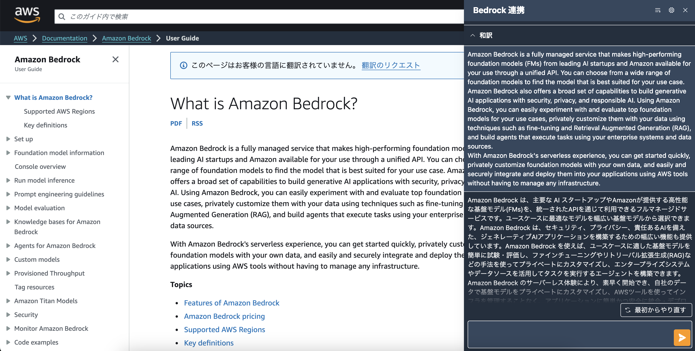

# ブラウザ拡張機能

こちらは、Generative AI Use Cases JP をより便利に利用するためのブラウザ拡張機能です。

> [!IMPORTANT]
> このブラウザ拡張機能を利用するためには、Generative AI Use Cases JP を事前にデプロイする必要があります。まずは、[こちら](https://github.com/aws-samples/generative-ai-use-cases-jp#%E3%83%87%E3%83%97%E3%83%AD%E3%82%A4)を参考にデプロイをしてください。

## Why Use ブラウザ拡張機能 ?

標準の Generative AI Use Cases JP の Web ページは便利に生成 AI を利用できますが、利用するたびに Web ページを開いてコピペするという使い方は、時には煩わしく感じることもあるでしょう。
このブラウザ拡張機能を利用すると、ブラウジング中に生成 AI を利用したくなったらページ変えずにそのまま生成 AI を利用できるため、さらに便利に生成 AI を活用することができます。

### 利用シチュエーション

- メールなどの返信
  - Web ブラウザからメーラーやチャットアプリを利用すれば、直接生成 AI に返信文を考えてもらうことができます。
- 翻訳
  - 社内情報であっても情報流出を気にすることなく、翻訳することができます。
- 単語の意味を調べる
  - 専門用語、英単語、読み方のわからない漢字などを、LLM に質問して意味を調べることができます。
- 要約
  - 長文の Web サイトの文章を要約してもらうことで、素早く概要を理解することができます。
- その他
  - このブラウザ拡張機能はプロンプトを自由にカスタマイズすることができるで、あなたのアイデア次第でさまざまな使い方が可能です。

## 利用方法

ブラウザ拡張機能を利用するためには、拡張機能をビルドして、そのビルドしたファイルをブラウザにインストールする必要があります。

詳しくは以下の手順を参照してください。

- [ビルド手順](../docs/EXTENSION_BUILD.md)
- [インストール手順](../docs/EXTENSION_INSTALL.md)

## FAQ

- 拡張機能をインストールすると誰でも利用できますか？
  - Generative AI Use Cases JP でユーザ登録している方は、ログインすることで全員利用可能です。
  - 各種認証の設定は、Generative AI Use Cases JP に従います。
  - **ユーザ登録していない方は、一切利用できません。**
- 社内情報を入れても安全ですか？
  - Amazon Bedrock は入力データを学習データとして利用しませんので、安心してご利用いただけます（[参考](https://aws.amazon.com/jp/bedrock/faqs/)）。
  - **社内情報を入力する前に、社内規定は十分に確認するようにしてください。**
- 拡張機能で送信した内容を見返すことはできますか？
  - 拡張機能で送信した内容は、一切保存しておりません。
  - 会話履歴機能の要望がある場合は、Issue へ投稿ください（対応を約束するものではありません）。
- どのブラウザで利用できますか？
  - Google Chrome と Microsoft Edge で利用できることは、確認しております。
- 社内に配布する方法を教えてください
  - [こちらの方法](../docs/EXTENSION_BUILD.md#配布方法)を参照ください。
- プリセットのプロンプトを追加したい
  - `browser-extension/src/app/features/prompt-settings/presetPrompts.ts` にプロンプトを設定して、再度「ビルド + インストール」をしてください。
- Generative AI Use Cases JP の Web 画面で使っているプロンプトを利用したい
  - Web 画面から保存したシステムコンテキストを利用できます。
  - 拡張機能の「プロンプト設定」画面から、利用設定を行なってください。
- ログインに失敗します
  - 以下のいずれかの原因が考えられます。
    - ユーザが登録されていない。
      - Web ページからログインできるか確認してください。
    - 設定が間違っている
      - 拡張機能の「設定」画面を開き、各設定項目が正しいかご確認ください。
      - 設定値は、[こちらの方法](../docs/EXTENSION_BUILD.md#その他のユーザー-windows-等)で確認できます。
