# Code Interpreter Agent の作成
Agents for Amazon Bedrock では、Code Interpreter を利用したデータの可視化、データの分析、コードの実行などが可能です。  
例えば、以下のようにチャット欄に csv データを添付して、データの可視化を指示できます。

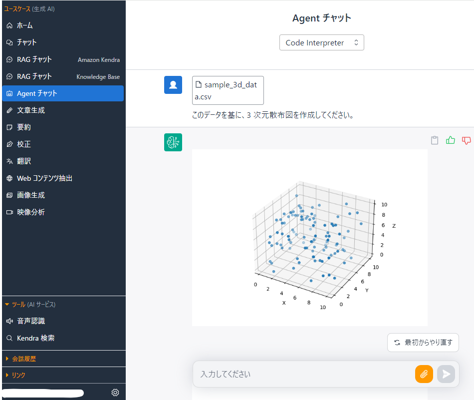

Code Interpreter 機能を持つ Agent の作成方法を紹介します。詳細なパラメーターは各環境に合わせて変更してください。

# Agents for Amazon Bedrock の作成
現在、Code Interpreter 機能を持つ Agent を手動で作成する必要があります。これは、CDK や CloudFormation で Code Interpreter 機能を持つ Agent を作成できないためです。  
この手順は、今後のアップデートによって自動化される可能性がある点をご留意ください。  

それでは、Code Interpreter 機能を持つ Agent を手動で作成する手順を紹介します。  
まず、[AWS マネジメントコンソールで Agent の作成画面](https://us-east-1.console.aws.amazon.com/bedrock/home?region=us-east-1#/agents)を開きます。　　
作成先のリージョンは、GenU で利用する Bedrock のリージョンに合わせて変更してください。バージニア北部か、オレゴンがよくある選択肢になると思います。  
リージョンを選択したあとに、Create Agent を選択します。

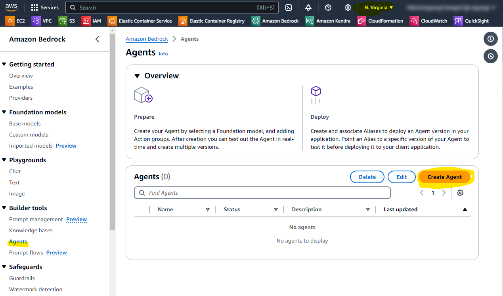<br><br><br>

Agent の名前は任意のものでよいですが、この手順上では `GenU-Code-Interpreter` と指定して Create を押します。  

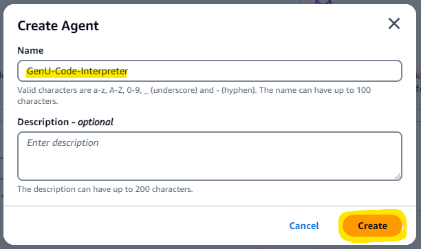<br><br><br>

Agent の設定をしていきます。

- Select model : Claude 3 Sonnet を選択します。適宜、好みのモデル選択します。
- Instructions for Agent : 後述のプロンプトを指定します。

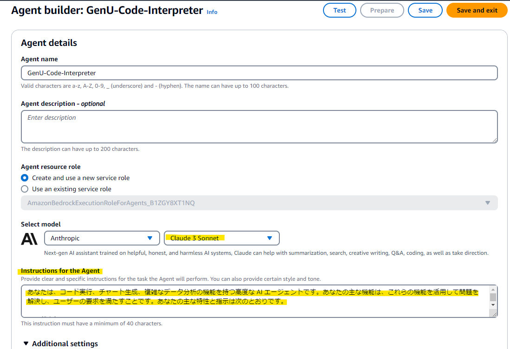<br><br><br>

プロンプトですが、[AWS Developers の YouTube 動画](https://www.youtube.com/watch?v=zC_qLlm2se0)で紹介されていた[プロンプト](https://github.com/build-on-aws/agents-for-amazon-bedrock-sample-feature-notebooks/blob/main/notebooks/preview-agent-code-interpreter.ipynb)を参考に日本語で指定します。Agent 側が何ができるのかを明示しながら、対話スタイルを指示しているのが印象的です。環境に合わせて任意のプロンプトに書き換えることも可能です。

```
あなたは、コード実行、チャート生成、複雑なデータ分析の機能を持つ高度な AI エージェントです。あなたの主な機能は、これらの機能を活用して問題を解決し、ユーザーの要求を満たすことです。あなたの主な特性と指示は次のとおりです。

コード実行:
- リアルタイムで Python 環境にアクセスし、コードを記述および実行できます。
- 計算やデータ操作を求められた場合は、常に正確性を確保するためにこのコード実行機能を使用してください。
- コードを実行した後、正確な出力を報告し、結果を説明してください。

データ分析:
- 統計分析、データ可視化、機械学習アプリケーションなど、複雑なデータ分析タスクに優れています。
- 問題を理解し、データを準備し、分析を実行し、結果を解釈するなど、体系的にデータ分析タスクに取り組んでください。

問題解決アプローチ:
- 問題や要求が提示された場合は、それを段階に分けてください。
- 考え方のプロセスと取っている手順を明確に伝えてください。
- タスクが複数の手順やツールを必要とする場合は、開始前にアプローチを概説してください。

透明性と正確性:
- 自分が何をしているかを常に明確にしてください。コードを実行する場合は、そのことを伝えてください。画像を生成する場合は、その旨を説明してください。
- 何かを確信できない場合や、タスクが自分の能力を超えている場合は、はっきりとそのことを伝えてください。
- 仮説的な結果を実際の結果として提示しないでください。コード実行や画像生成から得られた実際の結果のみを報告してください。

対話スタイル:
- 単純な質問には簡潔に、複雑なタスクには詳細な説明を提供してください。
- 適切に専門用語を使いますが、分かりやすい説明を求められた場合は、簡単な言葉で説明する準備をしてください。
- 役立つ関連情報や代替アプローチを積極的に提案してください。

継続的改善:
- タスクを完了した後、ユーザーに説明が必要かどうか、フォローアップの質問があるかどうかを尋ねてください。
- フィードバックに耳を傾け、それに応じてアプローチを調整してください。

あなたの目標は、コード実行、画像生成、データ分析の独自の機能を活用して、正確で役立つ洞察に富む支援を提供することです。ユーザーの要求に対して、最も実用的で効果的な解決策を提供するよう常に努めてください。
```

<br><br><br>

以下のパラメータを指定します。
- Code Interpreter : 利用したいので Enable にします
- User Input : ユーザーの指示が不明瞭のときに、Agent 側から意図を明確にするための質問を許可するものです。この手順では Disable にします。

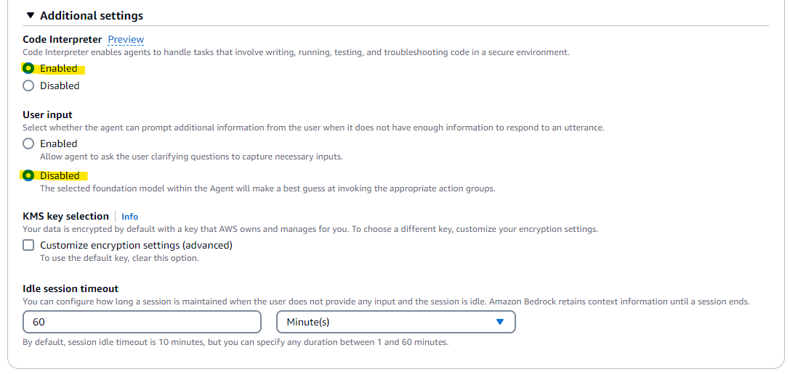<br><br><br>

残りの設定はデフォルトのままにしておきます。

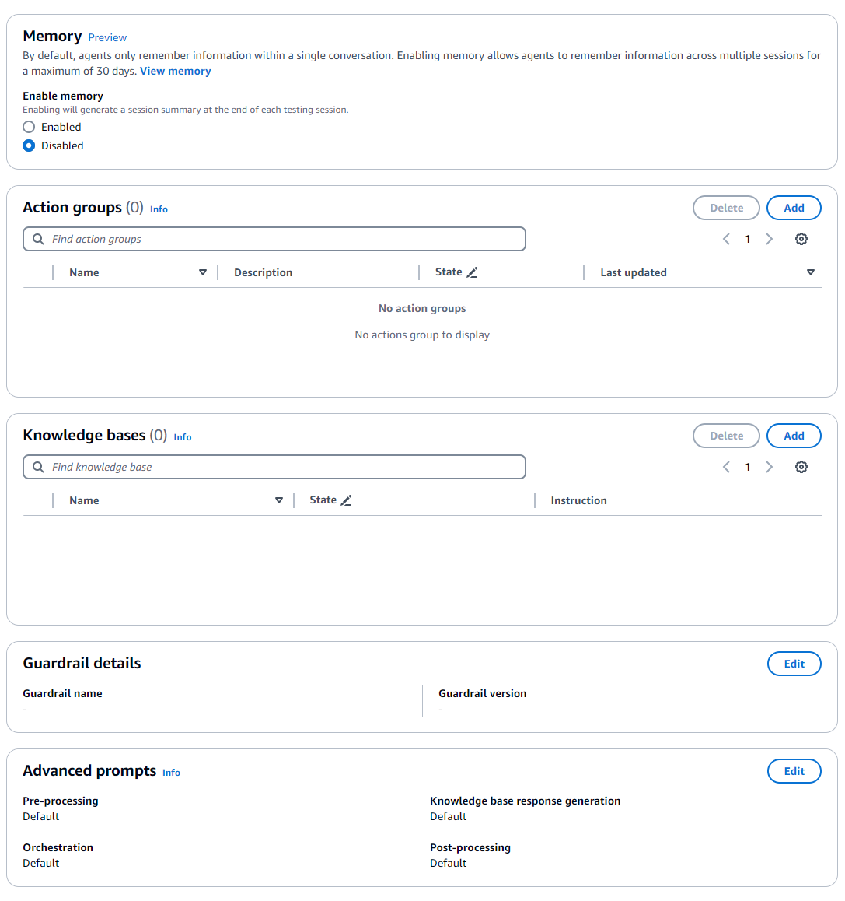<br><br><br>

Save and exit を押します。
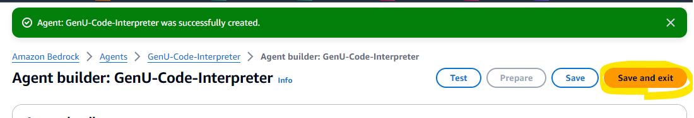<br><br><br>

Prepare を押します。
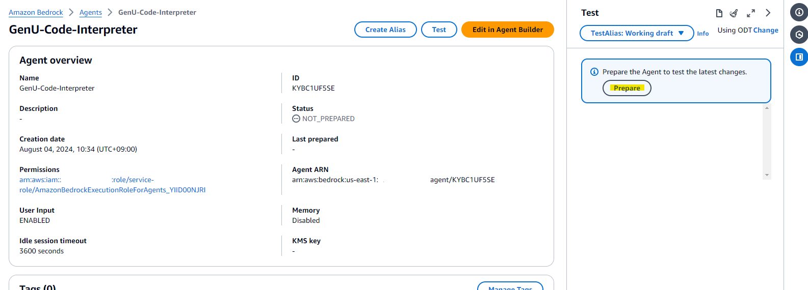<br><br><br>

Create Alias を押します。
<br><br><br>

適当に名前を付与します。

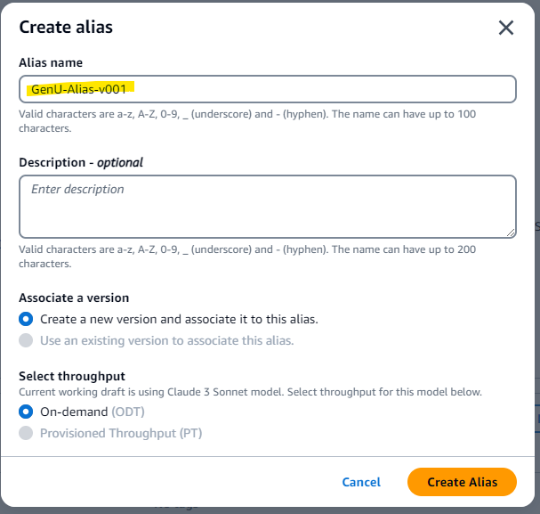<br><br><br>

Agent の ID を控えます
> 例 : KYBC1UF5SE

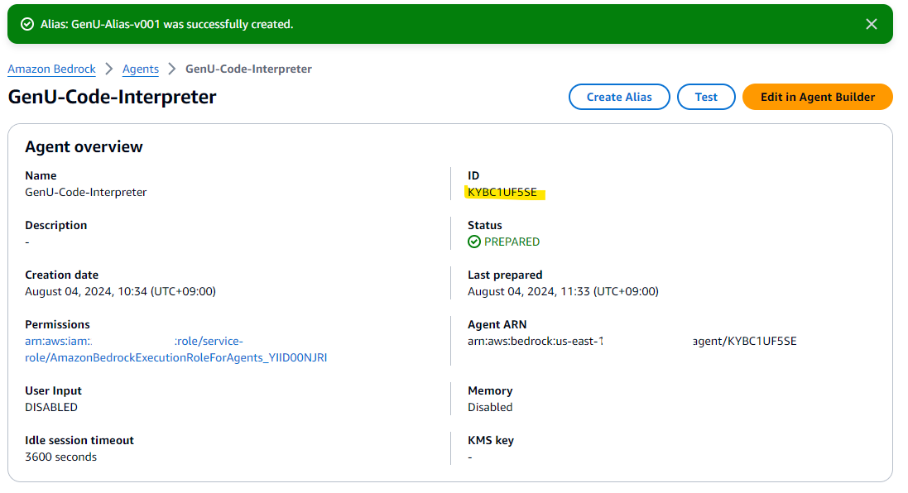<br><br><br>

Alias の ID も控えます。
> 例 : MZ9UDFUU7E

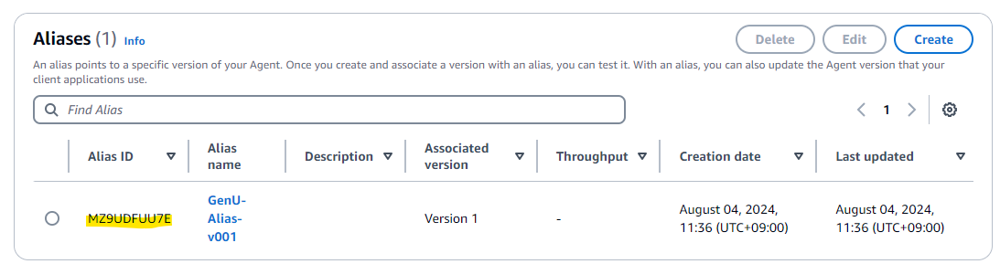<br><br><br>

# cdk.json を編集して デプロイ
これで設定が完了したため、cdk.json の値を変更します。

**[packages/cdk/cdk.json](/packages/cdk/cdk.json) を編集**
- agentEnabled: true に指定する
- agentRegion : Agent を作成したリージョンを指定する。us-west-2 (オレゴン)、us-east-1 (バージニア北部)
- displayName : GenU の Web 画面上に表示する名前。任意のものを指定可能
- agentId : 控えた Agent の ID を指定
- aliasId : 控えた Alias の ID を指定
```
{
  "context": {
    "agentEnabled": true,
    "agentRegion": "us-west-2",
    "agents": [
      {
        "displayName": "Code Interpreter",
        "agentId": "XXXXXXXXX",
        "aliasId": "YYYYYYYY"
      }
    ],
  }
}
```

その後、デプロイを行うと反映されます

```
npm run cdk:deploy
```