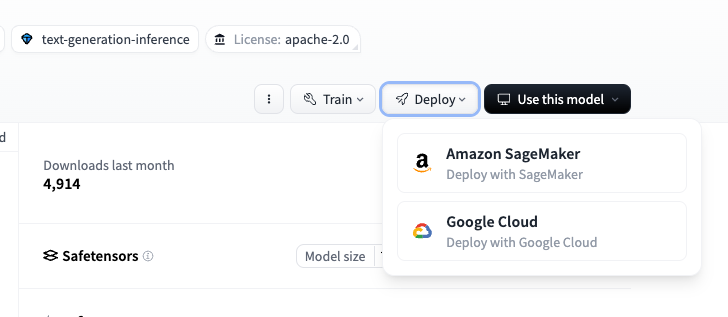

# デプロイオプション

## 設定方法

GenU は、parameter.ts もしくは AWS CDK の context で設定を変更します。

**複数環境の設定を定義できるため、新規に構築する場合は parameter.ts での指定を推奨します。後方互換性のために context > parameter.ts の順でパラメータを取得するようになっています。**

**Context を使う場合: CDK の context は '-c' でも指定できますが、その場合コードベースに変更が入らずフロントエンドのビルドが実施されないため、このアセットに関しては全ての設定は cdk.json の設定を変更することを推奨します。**

### parameter.ts の値を変更する方法

[packages/cdk/parameter.ts](/packages/cdk/parameter.ts) の値を変更することで設定します。

```typescript
// parameter.ts
const envs: Record<string, Partial<StackInput>> = {
  dev: {
    ragEnabled: false,
    // 他のパラメータも必要に応じてカスタマイズ
  },
  staging: {
    ragEnabled: false,
    // 他のパラメータも必要に応じてカスタマイズ
  },
  prod: {
    ragEnabled: true,
    // 他のパラメータも必要に応じてカスタマイズ
  },
};
```

CDK の context の `env` で指定した環境が `parameter.ts` で定義されている場合は、`parameter.ts` の値が優先されます。指定した `env` の環境が `parameter.ts` で定義されていない場合は、context の値で環境が作成されます。

[packages/cdk/cdk.json](/packages/cdk/cdk.json) の `context` で `env` を指定、もしくは `-c` で `env` を切り替えることが可能です。

```json
// cdk.json
{
  "context": {
    "env": "dev"
  }
}
```

```bash
# cdk.json の context.env で指定された env でデプロイ
npm run cdk:deploy

# 環境を prod に設定してデプロイ
npm run cdk:deploy -- -c env=prod
```

ローカルで開発する際は以下のように `env` を指定してください。

```bash
# cdk.json の context.env で指定された env のバックエンドを使用してローカルで開発
npm run web:devw

# dev2 環境のバックエンドを使用してローカルで開発
npm run web:devw --env=dev2
```

### cdk.json の値を変更する方法

[packages/cdk/cdk.json](/packages/cdk/cdk.json) の context 以下の値を変更することで設定します。例えば、`"ragEnabled": true` と設定することで RAG チャットのユースケースを有効化できます。context の値を設定した後、以下のコマンドで再度デプロイすることで設定が反映されます。

```bash
npm run cdk:deploy
```

## ユースケースの設定

### RAG チャット (Amazon Kendra) ユースケースの有効化

`ragEnabled` に `true` を指定します。(デフォルトは `false`)

**[parameter.ts](/packages/cdk/parameter.ts) を編集**
```typescript
// parameter.ts
const envs: Record<string, Partial<StackInput>> = {
  dev: {
    ragEnabled: true,
  },
};
```

**[packages/cdk/cdk.json](/packages/cdk/cdk.json) を編集**
```json
// cdk.json
{
  "context": {
    "ragEnabled": true
  }
}
```

変更後に `npm run cdk:deploy` で再度デプロイして反映させます。また、`/packages/cdk/rag-docs/docs` に保存されているデータが、自動で Kendra データソース用の S3 バケットにアップロードされます。(ただし `logs` から始まる名前のファイルは同期されませんので注意してください。)

続いて、Kendra の Data source の Sync を以下の手順で行ってください。

1. [Amazon Kendra のコンソール画面](https://console.aws.amazon.com/kendra/home) を開く
1. generative-ai-use-cases-index をクリック
1. Data sources をクリック
1. 「s3-data-source」をクリック
1. Sync now をクリック

Sync run history の Status / Summary に Completed が表示されれば完了です。S3 に保存されているファイルが同期されて、Kendra から検索できるようになります。

#### 既存の Amazon Kendra Index を利用したい場合

既存の Kendra Index を利用する場合も、上記のように `ragEnabled` は `true` である必要がある点に注意してください。

`kendraIndexArn` に Index の ARN を指定します。もし、既存の Kendra Index で S3 データソースを利用している場合は、`kendraDataSourceBucketName` にバケット名を指定します。

**[parameter.ts](/packages/cdk/parameter.ts) を編集**
```typescript
// parameter.ts
const envs: Record<string, Partial<StackInput>> = {
  dev: {
    kendraIndexArn: '<Kendra Index ARN>',
    kendraDataSourceBucketName: '<Kendra S3 Data Source Bucket Name>',
  },
};
```

**[packages/cdk/cdk.json](/packages/cdk/cdk.json) を編集**
```json
// cdk.json
{
  "context": {
    "kendraIndexArn": "<Kendra Index ARN>",
    "kendraDataSourceBucketName": "<Kendra S3 Data Source Bucket Name>"
  }
}
```

変更後に `npm run cdk:deploy` で再度デプロイして反映させます。

`<Kendra Index ARN>` は以下のような形式です

```
arn:aws:kendra:<Region>:<AWS Account ID>:index/<Index ID>
```

具体的には以下のような文字列です。

```
arn:aws:kendra:ap-northeast-1:333333333333:index/77777777-3333-4444-aaaa-111111111111
```

### RAG チャット (Knowledge Base) ユースケースの有効化

`ragKnowledgeBaseEnabled` に `true` を指定します。(デフォルトは `false`)  
作成ずみのKnowledge Baseがある場合、`ragKnowledgeBaseId` にナレッジベースIDを設定します。(`null`の場合、OpenSearch Serverlessのナレッジベースが作成されます)

**[parameter.ts](/packages/cdk/parameter.ts) を編集**
```typescript
// parameter.ts
const envs: Record<string, Partial<StackInput>> = {
  dev: {
    ragKnowledgeBaseEnabled: true,
    ragKnowledgeBaseId: 'XXXXXXXXXX',
    ragKnowledgeBaseStandbyReplicas: false,
    ragKnowledgeBaseAdvancedParsing: false,
    ragKnowledgeBaseAdvancedParsingModelId: 'anthropic.claude-3-sonnet-20240229-v1:0',
    ragKnowledgeBaseBinaryVector: false,
    embeddingModelId: 'amazon.titan-embed-text-v2:0',
  },
};
```

**[packages/cdk/cdk.json](/packages/cdk/cdk.json) を編集**
```json
// cdk.json
{
  "context": {
    "ragKnowledgeBaseEnabled": true,
    "ragKnowledgeBaseId": "XXXXXXXXXX",
    "ragKnowledgeBaseStandbyReplicas": false,
    "ragKnowledgeBaseAdvancedParsing": false,
    "ragKnowledgeBaseAdvancedParsingModelId": "anthropic.claude-3-sonnet-20240229-v1:0",
    "ragKnowledgeBaseBinaryVector": false,
    "embeddingModelId": "amazon.titan-embed-text-v2:0",
    "rerankingModelId": "amazon.rerank-v1:0",
    "queryDecompositionEnabled": true,
  }
}
```

`ragKnowledgeBaseStandbyReplicas` は自動作成される OpenSearch Serverless の冗長化に関する値です。
- `false` : 開発およびテスト目的に適した指定。シングル AZ で稼働し、OCU のコストを半分にできる。
- `true` : 本番環境に適した設定。複数の AZ で稼働し、高可用性な構成が実現できる。

`embeddingModelId` は embedding に利用するモデルです。現状、以下モデルをサポートしています。

```
"amazon.titan-embed-text-v1"
"amazon.titan-embed-text-v2:0"
"cohere.embed-multilingual-v3"
"cohere.embed-english-v3"
```

`rerankingModelId` は reranking に利用するモデルです。現状、以下モデルをサポートしています。（デフォルトは `null`）

```
"amazon.rerank-v1:0"
"cohere.rerank-v3-5:0"
```

`queryDecompositionEnabled` は query decomposition を有効化するかどうかです。（デフォルトは `false`）

変更後に `npm run cdk:deploy` で再度デプロイして反映させます。この際、`modelRegion` で指定されているリージョンに Knowledge Base がデプロイされます。以下に注意してください。

- `modelRegion` リージョンのモデルが 1 つ以上 `modelIds` に定義されている必要があります。
- `modelRegion` リージョンの Bedrock で `embeddingModelId` のモデルが有効化されている必要があります。
- `modelRegion` リージョンの Bedrock で `rerankingModelId` のモデルが有効化されている必要があります。
- `modelRegion` リージョンで `npm run cdk:deploy` の前に AWS CDK の Bootstrap が完了している必要があります。

```bash
# 以下はBootstrap するコマンドの例 (modelRegion が us-east-1 だとした場合)
npx -w packages/cdk cdk bootstrap --region us-east-1
```

デプロイ時に `/packages/cdk/rag-docs/docs` に保存されているデータが、自動で Knowledge Base データソース用の S3 バケットにアップロードされます。(ただし `logs` から始まる名前のファイルは同期されませんので注意してください。) デプロイ完了後、以下の手順で Knowledge Base の Data source を Sync してください。

1. [Knowledge Base のコンソール画面](https://console.aws.amazon.com/bedrock/home#/knowledge-bases) を開く
1. generative-ai-use-cases-jp をクリック
1. s3-data-source を選択肢、Sync をクリック

Status が Available になれば完了です。S3 に保存されているファイルが取り込まれており、Knowledge Base から検索できます。

> [!NOTE]
> RAG チャット (Knowledge Base) の設定を有効後に、再度無効化する場合は、`ragKnowledgeBaseEnabled: false` にして再デプロイすれば RAG チャット (Knowledge Base) は無効化されますが、`RagKnowledgeBaseStack` 自体は残ります。マネージメントコンソールを開き、modelRegion の CloudFormation から `RagKnowledgeBaseStack` というスタックを削除することで完全に消去ができます。

#### Advanced Parsing を有効化

[Advanced Parsing 機能](https://docs.aws.amazon.com/bedrock/latest/userguide/kb-chunking-parsing.html#kb-advanced-parsing) を有効化できます。Advanced Parsing は、ファイル内の表やグラフなどの非構造化データから、情報を分析および抽出する機能です。ファイル内のテキストに加えて、表やグラフなどから抽出したデータを付け加えることで、RAG の精度を上げやすくするメリットがあります。

- `ragKnowledgeBaseAdvancedParsing` : `true` で Advanced Parsing を有効化
- `ragKnowledgeBaseAdvancedParsingModelId` : 情報を抽出するときに利用するモデル ID を指定
  - サポートしているモデル (2024/08 現在)
    - `anthropic.claude-3-sonnet-20240229-v1:0`
    - `anthropic.claude-3-haiku-20240307-v1:0`

**[parameter.ts](/packages/cdk/parameter.ts) を編集**
```typescript
// parameter.ts
const envs: Record<string, Partial<StackInput>> = {
  dev: {
    ragKnowledgeBaseEnabled: true,
    ragKnowledgeBaseId: 'XXXXXXXXXX',
    ragKnowledgeBaseStandbyReplicas: false,
    ragKnowledgeBaseAdvancedParsing: true,
    ragKnowledgeBaseAdvancedParsingModelId: 'anthropic.claude-3-sonnet-20240229-v1:0',
    ragKnowledgeBaseBinaryVector: false,
    embeddingModelId: 'amazon.titan-embed-text-v2:0',
  },
};
```

**[packages/cdk/cdk.json](/packages/cdk/cdk.json) を編集**
```json
// cdk.json
{
  "context": {
    "ragKnowledgeBaseEnabled": true,
    "ragKnowledgeBaseId": "XXXXXXXXXX",
    "ragKnowledgeBaseStandbyReplicas": false,
    "ragKnowledgeBaseAdvancedParsing": true,
    "ragKnowledgeBaseAdvancedParsingModelId": "anthropic.claude-3-sonnet-20240229-v1:0",
    "ragKnowledgeBaseBinaryVector": false,
    "embeddingModelId": "amazon.titan-embed-text-v2:0",
  }
}
```

#### チャンク戦略を変更

[rag-knowledge-base-stack.ts](/packages/cdk/lib/rag-knowledge-base-stack.ts) に chunkingConfiguration を指定する箇所があります。
コメントアウトを外して、[CDK ドキュメント](https://docs.aws.amazon.com/cdk/api/v2/docs/aws-cdk-lib.aws_bedrock.CfnDataSource.ChunkingConfigurationProperty.html)や [CloudFormation ドキュメント](https://docs.aws.amazon.com/bedrock/latest/userguide/kb-chunking-parsing.html)を参考に任意のチャンク戦略へ変更が可能です。

例えば、セマンティックチャンクに変更する場合は、コメントアウトをはずして以下のように指定します。

```typescript
// packages/cdk/lib/rag-knowledge-base-stack.ts
// セマンティックチャンク
chunkingConfiguration: {
  chunkingStrategy: 'SEMANTIC',
  semanticChunkingConfiguration: {
    maxTokens: 300,
    bufferSize: 0,
    breakpointPercentileThreshold: 95,
  },
},
```

その後、[Knowledge Base や OpenSearch Service を再作成して変更を加える](./DEPLOY_OPTION.md#knowledge-base-や-opensearch-service-を再作成して変更を加える)の章を参照して、変更を加えます。

#### Binary Vector Embedding を有効化

[Binary Vector Embedding 機能](https://aws.amazon.com/jp/blogs/machine-learning/build-cost-effective-rag-applications-with-binary-embeddings-in-amazon-titan-text-embeddings-v2-amazon-opensearch-serverless-and-amazon-bedrock-knowledge-bases/) を有効化できます。Binary Vector Embedding は float（浮動小数点 32 bit）で表現していたベクトルデータを、binary（1 bit）で表現する機能です。バイナリ埋め込みは、ストレージ効率、計算速度、およびスケーラビリティに大きなメリットをもたらします。

- `ragKnowledgeBaseBinaryVector` : `true` で Binary Vector Embedding を有効化
  - [サポートしているモデル](https://docs.aws.amazon.com/bedrock/latest/userguide/knowledge-base-supported.html#knowledge-base-supported-embeddings) (2025/03 現在)
    - `amazon.titan-embed-text-v2:0`
    - `cohere.embed-multilingual-v3`
    - `cohere.embed-english-v3`


#### Knowledge Base や OpenSearch Service を再作成して変更を加える

[Knowledge Base のチャンク戦略](./DEPLOY_OPTION.md#チャンク戦略を変更)や、OpenSearch Service に関する以下のパラメーターについて、変更を加えた後に `npm run cdk:deploy` を実行しても変更が反映されません。

- `embeddingModelId`
- `ragKnowledgeBaseStandbyReplicas`
- `ragKnowledgeBaseAdvancedParsing`
- `ragKnowledgeBaseAdvancedParsingModelId`
- `ragKnowledgeBaseBinaryVector`

変更を反映する場合は、以下の手順で既存の Knowledge Base 関連のリソースを削除してから再作成を行います。

1. `ragKnowledgeBaseEnabled` を false にしてデプロイを行う
1. [CloudFormation](https://console.aws.amazon.com/cloudformation/home) (リージョンに注意) を開き、RagKnowledgeBaseStack クリック
1. 右上の Delete をクリックして を開き、RagKnowledgeBaseStack を削除  
 **S3 バケットや RAG 用のファイルも含めて削除され、一時的に RAG チャットが利用不可になります**
1. パラメータやチャンク戦略に変更を加える
1. RagKnowledgeBaseStack の削除完了後、再度 `npm run cdk:deploy` でデプロイ

RagKnowledgeBaseStack の削除に伴い、**RAG チャット用の S3 バケットや格納されている RAG 用のファイルが削除**されます。
S3 バケット内にアップロードした RAG 用のファイルが存在する場合は、退避したあとに再度アップロードしてください。
また、前述した手順に従い Data source を再度 Sync してください。

#### OpenSearch Service の Index をマネージメントコンソールで確認する方法

デフォルトでは、マネージメントコンソールから OpenSearch Service の Indexes タブを開くと `User does not have permissions for the requested resource` というエラーが表示されます。
これは、Data access policy でマネージメントコンソールにログインしている IAM ユーザーを許可していないためです。
以下の手順に従い、必要な権限を手動で追加してください。

1. [OpenSearch Service](https://console.aws.amazon.com/aos/home?#opensearch/collections) (リージョンに注意) を開き、generative-ai-use-cases-jp をクリック
1. ページ下部 Data access の Associated policy である generative-ai-use-cases-jp をクリック
1. 右上の Edit をクリック
1. ページ中部の Select principals の Add principals をクリックし、IAM User/Role 等 (マネージメントコンソールにログインしている権限) を追加
1. Save

保存後、少し時間をおいて再度アクセスしてください。

#### メタデータフィルターの設定

フィルターの設定は [packages/common/src/custom/rag-knowledge-base.ts](/packages/common/src/custom/rag-knowledge-base.ts) で行えます。必要に応じてカスタマイズしてご利用ください。

- `dynamicFilters` : 動的にアプリケーション側でフィルタを作成して適用します。（例: ユーザーの部署などの属性に応じてフィルタを作成して適用する）現状 Claude Sonnet ３.5 のみ対応しています。（クォータによりスロットリングが発生することがあります）Cognito Group や SAML IdP の Group を Attribute にマッピングして利用することも可能です。（詳細は [Microsoft Entra ID と SAML 連携](./SAML_WITH_ENTRA_ID.md) を参照）
- `implicitFilters` : 指定されている場合は LLM がユーザーの質問に応じて指定されたメタデータに対してフィルタを作成して適用します。 (例: ユーザーの質問に含まれる年をフィルターに指定して、その年のデータのみを検索する) 空配列の場合はフィルタは適用されません。
- `hiddenStaticExplicitFilters` : アプリケーションレベルで適用したいフィルタを適用します。（例: データの分類が秘密のデータは除外する）
- `userDefinedExplicitFilters` : アプリケーションの UI にて表示されるフィルターを定義します。


### Agent チャットユースケースの有効化

Agent チャットユースケースでは、以下のご利用が可能です。
- Code Interpreter を利用したデータの可視化、コード実行、データ分析
- Agents for Amazon Bedrock を利用したアクションを実行
- Knowledge Bases for Amazon Bedrock のベクトルデータベースを参照

Agent は `modelRegion` で指定したリージョンに生成されます。後述する `agentEnabled: true` は Code Interpreter エージェントと検索エージェントを作成するためのオプションで、手動で作成した Agent を追加する際には `agentEnabled: true` である必要はありません。

#### Code Interpreter エージェントのデプロイ

Code Interpreter を利用したデータの可視化、コード実行、データ分析などが実行できます。

Code Interpreter エージェントは Agent を有効化するとデプロイされます。

`agentEnabled` に `true` を指定します。(デフォルトは `false`)

**[parameter.ts](/packages/cdk/parameter.ts) を編集**
```typescript
// parameter.ts
const envs: Record<string, Partial<StackInput>> = {
  dev: {
    agentEnabled: true,
  },
};
```

**[packages/cdk/cdk.json](/packages/cdk/cdk.json) を編集**
```json
// cdk.json
{
  "context": {
    "agentEnabled": true,
  }
}
```

#### 検索エージェントのデプロイ

API と連携し最新情報を参照して回答する Agent を作成します。Agent のカスタマイズを行い他のアクションを追加できるほか、複数の Agent を作成し切り替えることが可能です。

デフォルトで使用できる検索エージェントでは、無料利用枠の大きさ・リクエスト数の制限・コストの観点から [Brave Search API の Data for AI](https://brave.com/search/api/) を使用していますが、他の API にカスタマイズすることも可能です。API キーの取得はフリープランでもクレジットカードの登録が必要になります。

> [!NOTE]
> Agent チャットユースケースを有効化すると Agent チャットユースケースでのみ外部 API にデータを送信します。（デフォルトでは Brave Search API）他のユースケースは引き続き AWS 内のみに閉じて利用することが可能です。社内ポリシー、API の利用規約などを確認してから有効化してください。

`agentEnabled` と `searchAgentEnabled` に `true` を指定し(デフォルトは `false`)、`searchApiKey` に検索エンジンの API キーを指定します。

**[parameter.ts](/packages/cdk/parameter.ts) を編集**
```typescript
// parameter.ts
const envs: Record<string, Partial<StackInput>> = {
  dev: {
    agentEnabled: true,
    searchAgentEnabled: true,
    searchApiKey: '<検索エンジンの API キー>',
  },
};
```

**[packages/cdk/cdk.json](/packages/cdk/cdk.json) を編集**
```json
// cdk.json
{
  "context": {
    "agentEnabled": true,
    "searchAgentEnabled": true,
    "searchApiKey": "<検索エンジンの API キー>",
  }
}
```

変更後に `npm run cdk:deploy` で再度デプロイして反映させます。これにより、デフォルトの検索エンジン Agent がデプロイされます。

> [!NOTE]
> 検索エージェントの設定を有効後に、再度無効化する場合は、`searchAgentEnabled: false` にして再デプロイすれば検索エージェントは無効化されますが、`WebSearchAgentStack` 自体は残ります。マネージメントコンソールを開き、`modelRegion` の CloudFormation から `WebSearchAgentStack` というスタックを削除することで完全に消去ができます。

#### 手動で作成した Agent を追加

デフォルトの Agent 以外に手動で作成した Agent を登録したい場合、以下のように追加の Agent を `agents` に追加してください。Agent は `modelRegion` で作成する点に留意してください。

> [!NOTE]
> `agentEnabled: true` は Code Interpreter エージェントと検索エージェントを作成するためのオプションですので、手動で作成した Agent を追加する際には `agentEnabled: true` である必要はありません。

**[parameter.ts](/packages/cdk/parameter.ts) を編集**
```typescript
// parameter.ts
const envs: Record<string, Partial<StackInput>> = {
  dev: {
    agents: [
      {
        displayName: 'MyCustomAgent',
        agentId: 'XXXXXXXXX',
        aliasId: 'YYYYYYYY',
      },
    ],
  },
};
```

**[packages/cdk/cdk.json](/packages/cdk/cdk.json) を編集**
```json
// cdk.json
{
  "context": {
    "agents": [
      {
        "displayName": "MyCustomAgent",
        "agentId": "XXXXXXXXX",
        "aliasId": "YYYYYYYY"
      }
    ],
  }
}
```

また、`packages/cdk/lib/construct/agent.ts` を改修し新たな Agent を定義することも可能です。CDK に定義した Agent を利用する場合は `agentEnabled: true` にしてください。

#### Knowledge Bases for Amazon Bedrock エージェントのデプロイ

Knowledge Bases for Amazon Bedrock と連携したエージェントを手動で作成し登録することも可能です。

まず、[ナレッジベースの AWS コンソール画面](https://console.aws.amazon.com/bedrock/home?#/knowledge-bases) から[Knowledge Bases for Amazon Bedrock のドキュメント](https://docs.aws.amazon.com/ja_jp/bedrock/latest/userguide/knowledge-base-create.html)を参考にナレッジベースを作成します。`modelRegion` と同じリージョンに作成してください。

続いて、 [エージェントの AWS コンソール画面](https://console.aws.amazon.com/bedrock/home?#/agents) から手動で Agent を作成します。設定は基本的にデフォルトのままで、Agent のプロンプトは以下の例を参考にプロンプトを入力します。アクショングループは必要ないため設定せずに進み、ナレッジベースでは前のステップで作成したナレッジベースを登録し、プロンプトは以下の例を参考に入力します。

```
Agent プロンプト例: あなたは指示に応えるアシスタントです。 指示に応じて情報を検索し、その内容から適切に回答してください。情報に記載のないものについては回答しないでください。複数回検索することが可能です。
Knowledge Base プロンプト例: キーワードで検索し情報を取得します。調査、調べる、Xについて教える、まとめるといったタスクで利用できます。会話から検索キーワードを推測してください。検索結果には関連度の低い内容も含まれているため関連度の高い内容のみを参考に回答してください。複数回実行可能です。
```

作成された Agent から Alias を作成し、`agentId` と `aliasId` をコピーし以下の形式で追加します。`displayName` は UI に表示したい名称を設定してください。また、`agentEnabled` を `true` にします。

**[parameter.ts](/packages/cdk/parameter.ts) を編集**
```typescript
// parameter.ts
const envs: Record<string, Partial<StackInput>> = {
  dev: {
    agentEnabled: true,
    agents: [
      {
        displayName: 'Knowledge Base',
        agentId: 'XXXXXXXXX',
        aliasId: 'YYYYYYYY',
      },
    ],
  },
};
```

**[packages/cdk/cdk.json](/packages/cdk/cdk.json) を編集**
```json
// cdk.json
{
  "context": {
    "agentEnabled": true,
    "agents": [
      {
        "displayName": "Knowledge Base",
        "agentId": "XXXXXXXXX",
        "aliasId": "YYYYYYYY"
      }
    ],
  }
}
```

#### Agent をインライン表示にする

Agent は、デフォルトでは「Agent チャット」というユースケースの中から Agent を選択する方式で利用できます。インライン表示のオプションを有効にすると、「Agent チャット」というユースケースは表示されなくなり、利用可能な全ての Agent が他のユースケースと同じように表示されるようになります。有効な Agent が存在する状態で、`inlineAgents` を `true` に設定してください。

**[parameter.ts](/packages/cdk/parameter.ts) を編集**
```typescript
// parameter.ts
const envs: Record<string, Partial<StackInput>> = {
  dev: {
    inlineAgents: true,
  },
};
```

**[packages/cdk/cdk.json](/packages/cdk/cdk.json) を編集**
```json
// cdk.json
{
  "context": {
    "inlineAgents": true
  }
}
```

### Flow チャットユースケースの有効化

Flow チャットユースケースでは、作成済みの Flow を呼び出すことができます。

`flows` 配列を追加または編集します。

[Amazon Bedrock Flows の AWS コンソール画面](https://console.aws.amazon.com/bedrock/home#/flows) から手動で Flows を作成します。その後、Alias を作成し、作成済みの Flow の `flowId` と `aliasId`, `flowName` を追加します。`description` にはユーザーの入力を促すための説明文章を記載します。この説明文章は Flow チャットのテキストボックスに記載されます。以下はその例です。

**[parameter.ts](/packages/cdk/parameter.ts) を編集**
```typescript
// parameter.ts
const envs: Record<string, Partial<StackInput>> = {
  dev: {
    flows: [
      {
        flowId: 'XXXXXXXXXX',
        aliasId: 'YYYYYYYYYY',
        flowName: 'WhatIsItFlow',
        description: '任意のキーワードをウェブ検索して、説明を返すフローです。文字を入力してください',
      },
    ],
  },
};
```

**[packages/cdk/cdk.json](/packages/cdk/cdk.json) を編集**
```json
// cdk.json
{
  "context": {
    "flows": [
      {
        "flowId": "XXXXXXXXXX",
        "aliasId": "YYYYYYYYYY",
        "flowName": "WhatIsItFlow",
        "description": "任意のキーワードをウェブ検索して、説明を返すフローです。文字を入力してください"
      },
      {
        "flowId": "ZZZZZZZZZZ",
        "aliasId": "OOOOOOOOOO",
        "flowName": "RecipeFlow",
        "description": "与えられたJSONをもとに、レシピを作成します。\n{\"dish\": \"カレーライス\", \"people\": 3} のように入力してください。"
      },
      {
        "flowId": "PPPPPPPPPP",
        "aliasId": "QQQQQQQQQQQ",
        "flowName": "TravelPlanFlow",
        "description": "与えられた配列をもとに、旅行計画を作成します。\n[{\"place\": \"東京\", \"day\": 3}, {\"place\": \"大阪\", \"day\": 2}] のように入力してください。"
      }
    ]
  }
}
```

### 画像生成ユースケースの有効化

`imageGenerationModelIds` にモデルを 1 つ以上定義すると有効化されます。
`imageGenerationModelIds` に関しては [Amazon Bedrock のモデルを変更する](#amazon-bedrock-のモデルを変更する) をご参照ください。
デフォルト値は [packages/cdk/lib/stack-input.ts](/packages/cdk/lib/stack-input.ts) をご参照ください。

### 動画生成ユースケースの有効化

`videoGenerationModelIds` にモデルを 1 つ以上定義すると有効化されます。
`videoGenerationModelIds` に関しては [Amazon Bedrock のモデルを変更する](#amazon-bedrock-のモデルを変更する) をご参照ください。
デフォルト値は [packages/cdk/lib/stack-input.ts](/packages/cdk/lib/stack-input.ts) をご参照ください。

### 映像分析ユースケースの有効化

映像分析ユースケースでは、映像の画像フレームとテキストを入力して画像の内容を LLM に分析させます。
映像分析ユースケースを直接有効化するオプションはありませんが、パラメータでマルチモーダルのモデルが有効化されている必要があります。

2025/03 現在、マルチモーダルのモデルは以下です。

```
"anthropic.claude-3-5-sonnet-20241022-v2:0",
"anthropic.claude-3-5-sonnet-20240620-v1:0",
"anthropic.claude-3-opus-20240229-v1:0",
"anthropic.claude-3-sonnet-20240229-v1:0",
"anthropic.claude-3-haiku-20240307-v1:0",
"us.anthropic.claude-3-5-sonnet-20240620-v1:0",
"us.anthropic.claude-3-opus-20240229-v1:0",
"us.anthropic.claude-3-sonnet-20240229-v1:0",
"us.anthropic.claude-3-haiku-20240307-v1:0",
"eu.anthropic.claude-3-5-sonnet-20240620-v1:0",
"eu.anthropic.claude-3-sonnet-20240229-v1:0",
"eu.anthropic.claude-3-haiku-20240307-v1:0",
"apac.anthropic.claude-3-haiku-20240307-v1:0",
"apac.anthropic.claude-3-sonnet-20240229-v1:0",
"apac.anthropic.claude-3-5-sonnet-20240620-v1:0",
"apac.anthropic.claude-3-5-sonnet-20241022-v2:0",
"us.meta.llama3-2-90b-instruct-v1:0",
"us.meta.llama3-2-11b-instruct-v1:0",
"amazon.nova-pro-v1:0",
"amazon.nova-lite-v1:0",
"us.amazon.nova-pro-v1:0",
"us.amazon.nova-lite-v1:0",
"eu.amazon.nova-pro-v1:0",
"eu.amazon.nova-lite-v1:0",
"apac.amazon.nova-pro-v1:0",
"apac.amazon.nova-lite-v1:0"
```

これらのいずれかが `modelIds` に定義されている必要があります。
詳細は[Amazon Bedrock のモデルを変更する](#amazon-bedrock-のモデルを変更する)を参照してください。

**[parameter.ts](/packages/cdk/parameter.ts) を編集**
```typescript
// parameter.ts
const envs: Record<string, Partial<StackInput>> = {
  dev: {
    modelIds: [
      'anthropic.claude-3-sonnet-20240229-v1:0',
    ]
  },
};
```

**[packages/cdk/cdk.json](/packages/cdk/cdk.json) を編集**
```json
// cdk.json
{
  "context": {
    "modelIds": [
      "anthropic.claude-3-sonnet-20240229-v1:0",
    ]
  }
}
```

### プロンプト最適化ツールの有効化

プロンプト最適化ツールは入力したプロンプトを指定したモデルに最適な形に変換します。
プロンプト最適化ツールを直接有効化するオプションはありませんが、パラメータの設定が以下の 2 点を満たす必要があります。
- `modelRegion`: Amazon Bedrock の Prompt optimization がサポートされているリージョンであること
- `modelIds`: Amazon Bedrock の Prompt optimization がサポートされているモデルが 1 つ以上指定されていること

Prompt optimization のサポート状況は [こちら](https://docs.aws.amazon.com/bedrock/latest/userguide/prompt-management-optimize.html) をご参照ください。

### 特定のユースケースを非表示にする

以下のオプションで指定できるユースケースは非表示にできます。
特に指定がない場合や false を指定した場合は表示されます。

**[parameter.ts](/packages/cdk/parameter.ts) を編集**
```typescript
// parameter.ts
const envs: Record<string, Partial<StackInput>> = {
  dev: {
    hiddenUseCases: {
      generate: true, // 文章生成を非表示
      summarize: true, // 要約を非表示
      writer: true, // 執筆を非表示
      translate: true, // 翻訳を非表示
      webContent: true, // Web コンテンツ抽出を非表示
      image: true, // 画像生成を非表示
      video: true, // 動画生成を非表示
      videoAnalyzer: true, // 映像分析を非表示
      diagram: true, // ダイアグラム生成を非表示
    }
  },
};
```

**[packages/cdk/cdk.json](/packages/cdk/cdk.json) を編集**
```json
// cdk.json
{
  "context": {
    "hiddenUseCases": {
      "generate": true,
      "summarize": true,
      "writer": true,
      "translate": true,
      "webContent": true,
      "image": true,
      "video": true,
      "videoAnalyzer": true,
      "diagram": true
    }
  }
}
```

## ユースケースビルダーの設定

ユースケースビルダーはデフォルトで有効化されており、デプロイ後画面上に表示される「ビルダーモード」という項目から利用できます。ユースケースビルダーを無効化する場合は、パラメータの `useCaseBuilderEnabled` に `false` を指定します。(デフォルトは `true`)

**[parameter.ts](/packages/cdk/parameter.ts) を編集**
```typescript
// parameter.ts
const envs: Record<string, Partial<StackInput>> = {
  dev: {
    useCaseBuilderEnabled: false,
  },
};
```

**[packages/cdk/cdk.json](/packages/cdk/cdk.json) を編集**
```json
// cdk.json
{
  "context": {
    "useCaseBuilderEnabled": false
  }
}
```

## Amazon Bedrock のモデルを変更する

`parameter.ts` もしくは `cdk.json` の `modelRegion`, `modelIds`, `imageGenerationModelIds`, `videoGenerationModelIds` でモデルとモデルのリージョンを指定します。`modelIds` と `imageGenerationModelIds` と `videoGenerationModelIds` は指定したリージョンで利用できるモデルの中から利用したいモデルのリストで指定してください。AWS ドキュメントに、[モデルの一覧](https://docs.aws.amazon.com/bedrock/latest/userguide/model-ids.html)と[リージョン別のモデルサポート一覧](https://docs.aws.amazon.com/bedrock/latest/userguide/models-regions.html)があります。

また、[cross-region inference](https://docs.aws.amazon.com/bedrock/latest/userguide/cross-region-inference-support.html)のモデルに対応しています。cross-region inference のモデルは `{us|eu|apac}.{model-provider}.{model-name}` で表されるモデルで、設定した modelRegion で指定したリージョンの `{us|eu|apac}` と一致している必要があります。

(例) `modelRegion` が `us-east-1` の場合、`us.anthropic.claude-3-5-sonnet-20240620-v1:0` は OK だが、`eu.anthropic.claude-3-5-sonnet-20240620-v1:0` は NG です。

このソリューションが対応しているテキスト生成モデルは以下です。

```
"anthropic.claude-3-5-sonnet-20241022-v2:0",
"anthropic.claude-3-5-haiku-20241022-v1:0",
"anthropic.claude-3-5-sonnet-20240620-v1:0",
"anthropic.claude-3-opus-20240229-v1:0",
"anthropic.claude-3-sonnet-20240229-v1:0",
"anthropic.claude-3-haiku-20240307-v1:0",
"us.anthropic.claude-3-7-sonnet-20250219-v1:0",
"us.anthropic.claude-3-5-sonnet-20241022-v2:0",
"us.anthropic.claude-3-5-haiku-20241022-v1:0",
"us.anthropic.claude-3-5-sonnet-20240620-v1:0",
"us.anthropic.claude-3-opus-20240229-v1:0",
"us.anthropic.claude-3-sonnet-20240229-v1:0",
"us.anthropic.claude-3-haiku-20240307-v1:0",
"eu.anthropic.claude-3-5-sonnet-20240620-v1:0",
"eu.anthropic.claude-3-sonnet-20240229-v1:0",
"eu.anthropic.claude-3-haiku-20240307-v1:0",
"apac.anthropic.claude-3-haiku-20240307-v1:0",
"apac.anthropic.claude-3-sonnet-20240229-v1:0",
"apac.anthropic.claude-3-5-sonnet-20240620-v1:0",
"apac.anthropic.claude-3-5-sonnet-20241022-v2:0",
"us.deepseek.r1-v1:0",
"amazon.titan-text-premier-v1:0",
"us.meta.llama3-3-70b-instruct-v1:0",
"us.meta.llama3-2-90b-instruct-v1:0",
"us.meta.llama3-2-11b-instruct-v1:0",
"us.meta.llama3-2-3b-instruct-v1:0",
"us.meta.llama3-2-1b-instruct-v1:0",
"meta.llama3-1-405b-instruct-v1:0",
"meta.llama3-1-70b-instruct-v1:0",
"meta.llama3-1-8b-instruct-v1:0",
"meta.llama3-70b-instruct-v1:0",
"meta.llama3-8b-instruct-v1:0",
"cohere.command-r-plus-v1:0",
"cohere.command-r-v1:0",
"mistral.mistral-large-2407-v1:0",
"mistral.mistral-large-2402-v1:0",
"mistral.mistral-small-2402-v1:0",
"anthropic.claude-v2:1",
"anthropic.claude-v2",
"anthropic.claude-instant-v1",
"mistral.mixtral-8x7b-instruct-v0:1",
"mistral.mistral-7b-instruct-v0:2",
"amazon.nova-pro-v1:0",
"amazon.nova-lite-v1:0",
"amazon.nova-micro-v1:0",
"us.amazon.nova-pro-v1:0",
"us.amazon.nova-lite-v1:0",
"us.amazon.nova-micro-v1:0",
"eu.amazon.nova-pro-v1:0",
"eu.amazon.nova-lite-v1:0",
"eu.amazon.nova-micro-v1:0",
"apac.amazon.nova-pro-v1:0",
"apac.amazon.nova-lite-v1:0",
"apac.amazon.nova-micro-v1:0"
```


このソリューションが対応している画像生成モデルは以下です。

```
"amazon.nova-canvas-v1:0",
"amazon.titan-image-generator-v2:0",
"amazon.titan-image-generator-v1",
"stability.sd3-large-v1:0",
"stability.sd3-5-large-v1:0",
"stability.stable-image-core-v1:0",
"stability.stable-image-core-v1:1",
"stability.stable-image-ultra-v1:0",
"stability.stable-image-ultra-v1:1",
"stability.stable-diffusion-xl-v1",
```

このソリューションが対応している動画生成モデルは以下です。

```
"amazon.nova-reel-v1:0",
"luma.ray-v2:0"
```

**指定したリージョンで指定したモデルが有効化されているかご確認ください。**

### 複数のリージョンのモデルを同時に利用する

GenU では、特に指定がない限り`modelRegion`のモデルを使用します。一部リージョンのみで利用可能な最新モデル等を使いたい場合、`modelIds`または`imageGenerationModelIds`または`videoGenerationModelIds`に`{modelId: '<モデル名>', region: '<リージョンコード>'}`を指定することで、そのモデルのみ指定したリージョンから呼び出すことができます。

> [!NOTE]
> [モニタリング用ダッシュボード](#モニタリング用のダッシュボードの有効化)と複数リージョンのモデル利用を併用する場合、デフォルトのダッシュボード設定では主リージョン（`modelRegion`で指定したリージョン）以外のモデルのプロンプトログが表示されません。
> 
> 全リージョンのプロンプトログを一つのダッシュボード上で一覧したい場合は、以下の追加設定が必要です：
> 
> 1. 各リージョンのAmazon Bedrock設定画面で「Model invocation logging」を手動で有効化する
> 2. CloudWatchダッシュボードに各リージョンのログを集計するウィジェットを追加する

#### 東京リージョンを優先しつつ、バージニア北部リージョン・オレゴンリージョンの最新のモデルも使いたい場合
**[parameter.ts](/packages/cdk/parameter.ts) を編集**
```typescript
// parameter.ts
const envs: Record<string, Partial<StackInput>> = {
  dev: {
    modelRegion: 'ap-northeast-1',
    modelIds: [
      {modelId: 'us.anthropic.claude-3-7-sonnet-20250219-v1:0', region: 'us-east-1'},
      'apac.anthropic.claude-3-5-sonnet-20241022-v2:0',
      'anthropic.claude-3-5-sonnet-20240620-v1:0',
      {modelId: 'us.anthropic.claude-3-5-haiku-20241022-v1:0', region: 'us-east-1'},
      'apac.amazon.nova-pro-v1:0',
      'apac.amazon.nova-lite-v1:0',
      'apac.amazon.nova-micro-v1:0',
      {modelId: 'us.deepseek.r1-v1:0', region: 'us-east-1'},
      {modelId: 'us.meta.llama3-3-70b-instruct-v1:0', region: 'us-east-1'},
      {modelId: 'us.meta.llama3-2-90b-instruct-v1:0', region: 'us-east-1'},
    ],
    imageGenerationModelIds: [
      'amazon.nova-canvas-v1:0',
      {modelId: 'stability.sd3-5-large-v1:0', region: 'us-west-2'},
      {modelId: 'stability.stable-image-core-v1:1', region: 'us-west-2'},
      {modelId: 'stability.stable-image-ultra-v1:1', region: 'us-west-2'},
    ],
    videoGenerationModelIds: [
      'amazon.nova-reel-v1:0',
      {modelId: 'luma.ray-v2:0', region: 'us-west-2'},
    ],
  },
};
```

**[packages/cdk/cdk.json](/packages/cdk/cdk.json) を編集**
```json
{
  "context": {
    "modelRegion": "ap-northeast-1",
    "modelIds": [
      {
        "modelId": "us.anthropic.claude-3-7-sonnet-20250219-v1:0",
        "region": "us-east-1"
      },
      "apac.anthropic.claude-3-5-sonnet-20241022-v2:0",
      "anthropic.claude-3-5-sonnet-20240620-v1:0",
      {
        "modelId": "us.anthropic.claude-3-5-haiku-20241022-v1:0",
        "region": "us-east-1"
      },
      "apac.amazon.nova-pro-v1:0",
      "apac.amazon.nova-lite-v1:0",
      "apac.amazon.nova-micro-v1:0",
      {
        "modelId": "us.deepseek.r1-v1:0",
        "region": "us-east-1"
      },
      {
        "modelId": "us.meta.llama3-3-70b-instruct-v1:0",
        "region": "us-east-1"
      },
      {
        "modelId": "us.meta.llama3-2-90b-instruct-v1:0",
        "region": "us-east-1"
      }
    ],
    "imageGenerationModelIds": [
      "amazon.nova-canvas-v1:0",
      {
        "modelId": "stability.sd3-5-large-v1:0",
        "region": "us-west-2"
      },
      {
        "modelId": "stability.stable-image-core-v1:1",
        "region": "us-west-2"
      },
      {
        "modelId": "stability.stable-image-ultra-v1:1",
        "region": "us-west-2"
      }
    ],
    "videoGenerationModelIds": [
      "amazon.nova-reel-v1:0",
      {
        "modelId": "luma.ray-v2:0",
        "region": "us-west-2"
      }
    ]
  }
}
```


### us-east-1 (バージニア) の Amazon Bedrock のモデルを利用する例

**[parameter.ts](/packages/cdk/parameter.ts) を編集**
```typescript
// parameter.ts
const envs: Record<string, Partial<StackInput>> = {
  dev: {
    modelRegion: 'us-east-1',
    modelIds: [
      "anthropic.claude-3-5-sonnet-20240620-v1:0",
      "anthropic.claude-3-sonnet-20240229-v1:0",
      "anthropic.claude-3-haiku-20240307-v1:0",
      "amazon.nova-pro-v1:0",
      "amazon.nova-lite-v1:0",
      "amazon.nova-micro-v1:0",
      "amazon.titan-text-premier-v1:0",
      "meta.llama3-70b-instruct-v1:0",
      "meta.llama3-8b-instruct-v1:0",
      "cohere.command-r-plus-v1:0",
      "cohere.command-r-v1:0",
      "mistral.mistral-large-2402-v1:0"
    ],
    imageGenerationModelIds: [
      "amazon.nova-canvas-v1:0",
      "amazon.titan-image-generator-v2:0",
      "amazon.titan-image-generator-v1",
      "stability.stable-diffusion-xl-v1"
    ],
    "videoGenerationModelIds": [
      "amazon.nova-reel-v1:0"
    ],
  },
};
```

**[packages/cdk/cdk.json](/packages/cdk/cdk.json) を編集**
```json
// cdk.json
{
  "context": {
    "modelRegion": "us-east-1",
    "modelIds": [
      "anthropic.claude-3-5-sonnet-20240620-v1:0",
      "anthropic.claude-3-sonnet-20240229-v1:0",
      "anthropic.claude-3-haiku-20240307-v1:0",
      "amazon.nova-pro-v1:0",
      "amazon.nova-lite-v1:0",
      "amazon.nova-micro-v1:0",
      "amazon.titan-text-premier-v1:0",
      "meta.llama3-70b-instruct-v1:0",
      "meta.llama3-8b-instruct-v1:0",
      "cohere.command-r-plus-v1:0",
      "cohere.command-r-v1:0",
      "mistral.mistral-large-2402-v1:0"
    ],
    "imageGenerationModelIds": [
      "amazon.nova-canvas-v1:0",
      "amazon.titan-image-generator-v2:0",
      "amazon.titan-image-generator-v1",
      "stability.stable-diffusion-xl-v1"
    ],
    "videoGenerationModelIds": [
      "amazon.nova-reel-v1:0"
    ],
  }
}
```

### us-west-2 (オレゴン) の Amazon Bedrock のモデルを利用する例

**[parameter.ts](/packages/cdk/parameter.ts) を編集**
```typescript
// parameter.ts
const envs: Record<string, Partial<StackInput>> = {
  dev: {
    modelRegion: 'us-west-2',
    modelIds: [
      "anthropic.claude-3-5-sonnet-20241022-v2:0",
      "anthropic.claude-3-5-haiku-20241022-v1:0",
      "anthropic.claude-3-5-sonnet-20240620-v1:0",
      "anthropic.claude-3-opus-20240229-v1:0",
      "anthropic.claude-3-sonnet-20240229-v1:0",
      "anthropic.claude-3-haiku-20240307-v1:0",
      "meta.llama3-1-70b-instruct-v1:0",
      "meta.llama3-1-8b-instruct-v1:0",
      "cohere.command-r-plus-v1:0",
      "cohere.command-r-v1:0",
      "mistral.mistral-large-2407-v1:0"
    ],
    imageGenerationModelIds: [
      "amazon.titan-image-generator-v2:0",
      "amazon.titan-image-generator-v1",
      "stability.sd3-large-v1:0",
      "stability.sd3-5-large-v1:0",
      "stability.stable-image-core-v1:0",
      "stability.stable-image-core-v1:1",
      "stability.stable-image-ultra-v1:0",
      "stability.stable-image-ultra-v1:1",
      "stability.stable-diffusion-xl-v1",
    ],
  },
};
```

**[packages/cdk/cdk.json](/packages/cdk/cdk.json) を編集**
```json
// cdk.json
{
  "context": {
    "modelRegion": "us-west-2",
    "modelIds": [
      "anthropic.claude-3-5-sonnet-20241022-v2:0",
      "anthropic.claude-3-5-haiku-20241022-v1:0",
      "anthropic.claude-3-5-sonnet-20240620-v1:0",
      "anthropic.claude-3-opus-20240229-v1:0",
      "anthropic.claude-3-sonnet-20240229-v1:0",
      "anthropic.claude-3-haiku-20240307-v1:0",
      "meta.llama3-1-70b-instruct-v1:0",
      "meta.llama3-1-8b-instruct-v1:0",
      "cohere.command-r-plus-v1:0",
      "cohere.command-r-v1:0",
      "mistral.mistral-large-2407-v1:0"
    ],
    "imageGenerationModelIds": [
      "amazon.titan-image-generator-v2:0",
      "amazon.titan-image-generator-v1",
      "stability.sd3-large-v1:0",
      "stability.sd3-5-large-v1:0"
      "stability.stable-image-core-v1:0",
      "stability.stable-image-core-v1:1",
      "stability.stable-image-ultra-v1:0",
      "stability.stable-image-ultra-v1:1",
      "stability.stable-diffusion-xl-v1",
    ],
  }
}
```

### cross-region inference が対応しているモデルで us(北部バージニアもしくはオレゴン) の Amazon Bedrock のモデルを利用する場合

**[parameter.ts](/packages/cdk/parameter.ts) を編集**
```typescript
// parameter.ts
const envs: Record<string, Partial<StackInput>> = {
  dev: {
    modelRegion: 'us-east-2',
    modelIds: [
      "us.anthropic.claude-3-7-sonnet-20250219-v1:0",
      "us.anthropic.claude-3-5-sonnet-20241022-v2:0",
      "us.anthropic.claude-3-5-haiku-20241022-v1:0",
      "us.anthropic.claude-3-5-sonnet-20240620-v1:0",
      "us.anthropic.claude-3-opus-20240229-v1:0",
      "us.anthropic.claude-3-sonnet-20240229-v1:0",
      "us.anthropic.claude-3-haiku-20240307-v1:0",
      "us.deepseek.r1-v1:0",
      "us.meta.llama3-3-70b-instruct-v1:0",
      "us.meta.llama3-2-90b-instruct-v1:0",
      "us.meta.llama3-2-11b-instruct-v1:0",
      "us.meta.llama3-2-3b-instruct-v1:0",
      "us.meta.llama3-2-1b-instruct-v1:0",
      "us.amazon.nova-pro-v1:0",
      "us.amazon.nova-lite-v1:0",
      "us.amazon.nova-micro-v1:0",
      "cohere.command-r-plus-v1:0",
      "cohere.command-r-v1:0",
      "mistral.mistral-large-2407-v1:0",
    ],
    imageGenerationModelIds: [
      "amazon.titan-image-generator-v2:0",
      "amazon.titan-image-generator-v1",
      "stability.sd3-large-v1:0",
      "stability.sd3-5-large-v1:0"
      "stability.stable-image-core-v1:0",
      "stability.stable-image-core-v1:1",
      "stability.stable-image-ultra-v1:0",
      "stability.stable-image-ultra-v1:1",
      "stability.stable-diffusion-xl-v1",
    ],
  },
};
```

**[packages/cdk/cdk.json](/packages/cdk/cdk.json) を編集**
```json
// cdk.json
{
  "context": {
    "modelRegion": "us-west-2",
    "modelIds": [
      "us.anthropic.claude-3-7-sonnet-20250219-v1:0",
      "us.anthropic.claude-3-5-sonnet-20241022-v2:0",
      "us.anthropic.claude-3-5-haiku-20241022-v1:0",
      "us.anthropic.claude-3-5-sonnet-20240620-v1:0",
      "us.anthropic.claude-3-opus-20240229-v1:0",
      "us.anthropic.claude-3-sonnet-20240229-v1:0",
      "us.anthropic.claude-3-haiku-20240307-v1:0",
      "us.deepseek.r1-v1:0",
      "us.meta.llama3-3-70b-instruct-v1:0",
      "us.meta.llama3-2-90b-instruct-v1:0",
      "us.meta.llama3-2-11b-instruct-v1:0",
      "us.meta.llama3-2-3b-instruct-v1:0",
      "us.meta.llama3-2-1b-instruct-v1:0",
      "us.amazon.nova-pro-v1:0",
      "us.amazon.nova-lite-v1:0",
      "us.amazon.nova-micro-v1:0",
      "cohere.command-r-plus-v1:0",
      "cohere.command-r-v1:0",
      "mistral.mistral-large-2407-v1:0"
    ],
    "imageGenerationModelIds": [
      "amazon.titan-image-generator-v2:0",
      "amazon.titan-image-generator-v1",
      "stability.sd3-large-v1:0",
      "stability.sd3-5-large-v1:0"
      "stability.stable-image-core-v1:0",
      "stability.stable-image-core-v1:1",
      "stability.stable-image-ultra-v1:0",
      "stability.stable-image-ultra-v1:1",
      "stability.stable-diffusion-xl-v1",
    ],
  }
}
```

### ap-northeast-1 (東京) の Amazon Bedrock のモデルを利用する例

**[parameter.ts](/packages/cdk/parameter.ts) を編集**
```typescript
// parameter.ts
const envs: Record<string, StackInput> = {
  dev: {
    modelRegion: 'ap-northeast-1',
    modelIds: [
      "anthropic.claude-3-5-sonnet-20240620-v1:0",
      "anthropic.claude-3-haiku-20240307-v1:0"
    ],
    imageGenerationModelIds: [
      "amazon.nova-canvas-v1:0"
    ],
    videoGenerationModelIds: [
      "amazon.nova-reel-v1:0"
    ],
  }
}
```

**[packages/cdk/cdk.json](/packages/cdk/cdk.json) を編集**
```json
// cdk.json
{
  "context": {
    "modelRegion": "ap-northeast-1",
    "modelIds": [
      "anthropic.claude-3-5-sonnet-20240620-v1:0",
      "anthropic.claude-3-haiku-20240307-v1:0"
    ],
    "imageGenerationModelIds": [
      "amazon.nova-canvas-v1:0"
    ],
    "videoGenerationModelIds": [
      "amazon.nova-reel-v1:0"
    ],
  }
}
```

## Amazon SageMaker のカスタムモデルを利用したい場合

Amazon SageMaker エンドポイントにデプロイされた大規模言語モデルを利用することが可能です。[Text Generation Inference (TGI) の Hugging Face LLM 推論コンテナ](https://aws.amazon.com/blogs/machine-learning/announcing-the-launch-of-new-hugging-face-llm-inference-containers-on-amazon-sagemaker/) を使用した SageMaker Endpoint に対応しています。モデルはユーザーとアシスタントが交互に発言するチャット形式のプロンプトをサポートしているものが理想的です。現在、画像生成ユースケースは Amazon SageMaker エンドポイントに対応していないので、ご注意ください。

TGI コンテナを使用したモデルを SageMaker エンドポイントにデプロイする方法は現在2通りあります。

**SageMaker JumpStart で AWS が事前に用意したモデルをデプロイ**

SageMaker JumpStart では OSS の大規模言語モデルをワンクリックでデプロイできるようにパッケージングして提供しています。SageMaker Studio の JumpStart 画面からモデルを開き "デプロイ" ボタンをクリックしデプロイすることが可能です。提供している日本語モデルとしては例として以下のようなモデルを提供しています。

- [SageMaker JumpStart Elyza Japanese Llama 2 7B Instructt](https://aws.amazon.com/jp/blogs/news/sagemaker-jumpstart-elyza-7b/)
- [SageMaker JumpStart Elyza Japanese Llama 2 13B Instructt](https://aws.amazon.com/jp/blogs/news/sagemaker-jumpstart-elyza-7b/)
- [SageMaker JumpStart CyberAgentLM2 7B Chat](https://aws.amazon.com/jp/blogs/news/cyberagentlm2-on-sagemaker-jumpstart/)
- [SageMaker JumpStart Stable LM Instruct Alpha 7B v2](https://aws.amazon.com/jp/blogs/news/japanese-stable-lm-instruct-alpha-7b-v2-from-stability-ai-is-now-available-in-amazon-sagemaker-jumpstart/)
- [SageMaker JumpStart Rinna 3.6B](https://aws.amazon.com/jp/blogs/news/generative-ai-rinna-japanese-llm-on-amazon-sagemaker-jumpstart/)
- [SageMaker JumpStart Bilingual Rinna 4B](https://aws.amazon.com/jp/blogs/news/generative-ai-rinna-japanese-llm-on-amazon-sagemaker-jumpstart/)

**SageMaker SDK を使用して数行のコードでデプロイ**

[AWS と Hugging Face の提携](https://aws.amazon.com/jp/blogs/news/aws-and-hugging-face-collaborate-to-make-generative-ai-more-accessible-and-cost-efficient/)により、SageMaker SDK で Hugging Face に公開されているモデルの ID を指定するだけでモデルのデプロイが可能です。

公開されている Hugging Face のモデルページから *Deploy* > *Amazon SageMaker* を選択するとモデルをデプロイするためのコードが表示されるため、こちらをコピーして実行すればモデルをデプロイすることが可能です。（モデルによりインスタンスサイズや `SM_NUM_GPUS` などのパラメータを変更する必要がある場合があります。デプロイに失敗した際は CloudWatch Logs からログを確認することが可能です）

> [!NOTE]
> デプロイする際、一箇所だけ修正点があります。エンドポイント名が GenU アプリケーションに表示されるほか、モデルのプロンプトテンプレート（次セクションにて説明）をエンドポイント名から判断しているためモデルを区別できるエンドポイント名を指定する必要があります。
そのため、デプロイする際に `huggingface_model.deploy()` の引数に `endpoint_name="<モデルを区別できるエンドポイント名>"` を追加してください。




### デプロイしたモデルを GenU から呼び出す設定

デプロイした SageMaker エンドポイントをターゲットのソリューションをデプロイする際は、以下のように指定することができます。

endpointNames は SageMaker エンドポイント名のリストです。（例：`["elyza-llama-2", "rinna"]`）

バックエンドでプロンプトを構築する際のプロンプトテンプレートを指定するために便宜上エンドポイント名の中にプロンプトの種類を含める必要があります。（例：`llama-2`、`rinna` など）詳しくは `packages/cdk/lambda/utils/models.ts` を参照してください。必要に応じてプロンプトテンプレートを追加してご利用ください。

```typescript
// parameter.ts
const envs: Record<string, Partial<StackInput>> = {
  dev: {
    modelRegion: 'us-east-1',
    endpointNames: ["jumpstart-dft-hf-llm-rinna-3-6b-instruction-ppo-bf16","jumpstart-dft-bilingual-rinna-4b-instruction-ppo-bf16"],
  },
};
```

```json
// cdk.json
{
  "context": {
    "modelRegion": "<SageMaker Endpoint Region>",
    "endpointNames": ["<SageMaker Endpoint Name>"],
  }
}
```

**Rinna 3.6B と Bilingual Rinna 4B を利用する例**

```json
// cdk.json
{
  "context": {
    "modelRegion": "us-west-2",
    "endpointNames": ["jumpstart-dft-hf-llm-rinna-3-6b-instruction-ppo-bf16","jumpstart-dft-bilingual-rinna-4b-instruction-ppo-bf16"],
  }
}
```

**ELYZA-japanese-Llama-2-7b-instruct を利用する例**

```json
// cdk.json
{
  "context": {
    "modelRegion": "us-west-2",
    "endpointNames": ["elyza-japanese-llama-2-7b-inference"],
  }
}
```

## セキュリティ関連設定

### セルフサインアップを無効化する

`selfSignUpEnabled` に `false` を指定します。(デフォルトは `true`)

**[parameter.ts](/packages/cdk/parameter.ts) を編集**
```typescript
// parameter.ts
const envs: Record<string, Partial<StackInput>> = {
  dev: {
    selfSignUpEnabled: false,
  },
};
```

**[packages/cdk/cdk.json](/packages/cdk/cdk.json) を編集**
```json
// cdk.json
{
  "context": {
    "selfSignUpEnabled": false,
  }
}
```

### サインアップできるメールアドレスのドメインを制限する
`allowedSignUpEmailDomains` に 許可するドメインのリストを指定します（デフォルトは`null`）。

値はstringのlist形式で指定し、各stringには"@"を含めないでください。メールアドレスのドメインが、許可ドメインのいずれか同じであればサインアップできます。`null` を指定すると何も制限されず、すべてのドメインを許可します。`[]` を指定するとすべて禁止し、どのドメインのメールアドレスでも登録できません。

設定すると、許可ドメインでないユーザは、Webのサインアップ画面で「アカウントを作る」を実行したときにエラーになり、GenU へのサインアップができなくなります。また、AWSマネジメントコンソールで、Cognitoのサービス画面から「ユーザを作成」を実行したときにエラーになります。

既にCognitoに作成されているユーザには影響ありません。新規にサインアップ・作成しようとしているユーザのみに適用されます。

設定例

- `amazon.com` のドメインのメールアドレスであればサインアップできるように設定する例

**[parameter.ts](/packages/cdk/parameter.ts) を編集**
```typescript
// parameter.ts
const envs: Record<string, Partial<StackInput>> = {
  dev: {
    allowedSignUpEmailDomains: ["amazon.com"],
  },
};
```

**[packages/cdk/cdk.json](/packages/cdk/cdk.json) を編集**
```json
// cdk.json
{
  "context": {
    "allowedSignUpEmailDomains": ["amazon.com"], // null から、許可ドメインを指定することで有効化
  }
}
```

- `amazon.com` か `amazon.jp` のどちらかのドメインのメールアドレスであればサインアップできるように設定する例

**[parameter.ts](/packages/cdk/parameter.ts) を編集**
```typescript
// parameter.ts
const envs: Record<string, Partial<StackInput>> = {
  dev: {
    allowedSignUpEmailDomains: ["amazon.com", "amazon.jp"],
  },
};
```

**[packages/cdk/cdk.json](/packages/cdk/cdk.json) を編集**
```json
// cdk.json
{
  "context": {
    "allowedSignUpEmailDomains": ["amazon.com", "amazon.jp"], // null から、許可ドメインを指定することで有効化
  }
}
```

### AWS WAF による制限を有効化する

#### IP アドレスによる制限

Web アプリへのアクセスを IP アドレスで制限したい場合、AWS WAF による IP アドレス制限を有効化することができます。 `allowedIpV4AddressRanges` では許可する IPv4 の CIDR を配列で指定することができ、`allowedIpV6AddressRanges` では許可する IPv6 の CIDR を配列で指定することができます。

**[parameter.ts](/packages/cdk/parameter.ts) を編集**
```typescript
// parameter.ts
const envs: Record<string, Partial<StackInput>> = {
  dev: {
    allowedIpV4AddressRanges: ["192.168.0.0/24"],
    allowedIpV6AddressRanges: ["2001:0db8::/32"],
  },
};
```

**[packages/cdk/cdk.json](/packages/cdk/cdk.json) を編集**
```json
// cdk.json
{
  "context": {
    "allowedIpV4AddressRanges": ["192.168.0.0/24"], // null から、許可 CIDR リストを指定することで有効化
    "allowedIpV6AddressRanges": ["2001:0db8::/32"], // null から、許可 CIDR リストを指定することで有効化
  }
}
```


#### 地理的制限

Web アプリへのアクセスをアクセス元の国で制限したい場合、AWS WAF による地理的制限を有効化することができます。 `allowedCountryCodes` で許可する国を Country Code の配列で指定することができます。
指定する国の Country Code は[ISO 3166-2 from wikipedia](https://en.wikipedia.org/wiki/ISO_3166-2)をご参照ください。

「IP アドレスによる制限」も同時に設定している場合は、「送信元の IP アドレスが許可された IP アドレスに含まれている**かつ**、許可された国からのアクセス」のみ許可されます。

**[parameter.ts](/packages/cdk/parameter.ts) を編集**
```typescript
// parameter.ts
const envs: Record<string, Partial<StackInput>> = {
  dev: {
    allowedCountryCodes: ["JP"],
  },
};
```

**[packages/cdk/cdk.json](/packages/cdk/cdk.json) を編集**
```json
// cdk.json
{
  "context": {
    "allowedCountryCodes": ["JP"], // null から、許可国リストを指定することで有効化
  }
}
```

`allowedIpV4AddressRanges` あるいは `allowedIpV6AddressRanges` あるいは `allowedCountryCodes` のいずれかを指定して再度 `npm run cdk:deploy` を実行すると、WAF 用のスタックが us-east-1 にデプロイされます（AWS WAF V2 は CloudFront に使用する場合、us-east-1 のみしか現状対応していません）。us-east-1 で CDK を利用したことがない場合は、以下のコマンドを実行して、デプロイ前に Bootstrap を行ってください。

```bash
npx -w packages/cdk cdk bootstrap --region us-east-1
```

### SAML 認証

Google Workspace や Microsoft Entra ID (旧 Azure Active Directory) などの IdP が提供する SAML 認証機能と連携ができます。次に詳細な連携手順があります。こちらもご活用ください。  
- [Google Workspace と SAML 連携](SAML_WITH_GOOGLE_WORKSPACE.md)
- [Microsoft Entra ID と SAML 連携](SAML_WITH_ENTRA_ID.md)

**[parameter.ts](/packages/cdk/parameter.ts) を編集**
```typescript
// parameter.ts
const envs: Record<string, Partial<StackInput>> = {
  dev: {
    samlAuthEnabled: true,
    samlCognitoDomainName: "your-preferred-name.auth.ap-northeast-1.amazoncognito.com",
    samlCognitoFederatedIdentityProviderName: "EntraID",
  },
};
```

**[packages/cdk/cdk.json](/packages/cdk/cdk.json) を編集**
```json
// cdk.json
{
  "context": {
    "samlAuthEnabled": true,
    "samlCognitoDomainName": "your-preferred-name.auth.ap-northeast-1.amazoncognito.com",
    "samlCognitoFederatedIdentityProviderName": "EntraID",
  }
}
```

- samlAuthEnabled : `true` にすることで、SAML 専用の認証画面に切り替わります。Cognito user pools を利用した従来の認証機能は利用できなくなります。
- samlCognitoDomainName : Cognito の App integration で設定する Cognito Domain 名を指定します。
- samlCognitoFederatedIdentityProviderName : Cognito の Sign-in experience で設定する Identity Provider の名前を指定します。


### ガードレール

Converse API を使う(=テキスト出力を行う生成 AI モデル)場合はガードレールを適用させることが可能です。設定するには `guardrailEnabled` を `true` に変更しデプロイしなおします。

**[parameter.ts](/packages/cdk/parameter.ts) を編集**
```typescript
// parameter.ts
const envs: Record<string, Partial<StackInput>> = {
  dev: {
    guardrailEnabled: true,
  },
};
```

**[packages/cdk/cdk.json](/packages/cdk/cdk.json) を編集**
```json
// cdk.json
{
  "context": {
    "guardrailEnabled" : true,
  }
}
```

デフォルトで適用されるガードレールは機微情報フィルターで日本語での会話の中で効果があったものを適用しています。他にも単語フィルターのカスタム、機微情報フィルターの正規表現は機能することを確認しており、必要に応じて、`packages/cdk/lib/construct/guardrail.ts` を修正してください。詳細は[Guardrails for Amazon Bedrock](https://docs.aws.amazon.com/bedrock/latest/userguide/guardrails.html)と[CfnGuardrail](https://docs.aws.amazon.com/cdk/api/v2/docs/aws-cdk-lib.aws_bedrock.CfnGuardrail.html)をご参照ください。

> [!NOTE]
> ガードレールの設定を有効後に、再度無効化する場合は、`guardrailEnabled: false` にして再デプロイすれば生成 AI を呼び出す際にガードレールは無効化されますが、ガードレール自体は残ります。マネージメントコンソールを開き、modelRegion の CloudFormation から `GuardrailStack` というスタックを削除することで完全に消去ができます。ガードレールが残ること自体にコストは発生しませんが、使用しないリソースは削除するのが望ましいです。

## コスト関連設定

### Kendraのインデックスを自動で作成・削除するスケジュールを設定する

GenerativeAiUseCasesDashboardStack で作成する Kendra のインデックスを、決められたスケジュールで自動で作成・削除するための設定を行います。これによって、Kendraのインデックスを稼働時間に対して発生する利用料を抑えることができます。Kendraインデックスを作成した後は、本リポジトリでデフォルトで作成されるS3データソースに対して、同期を自動で実行します。

この機能は、「`ragEnabled` が `true` 」かつ「`kendraIndexArn` が `null` 」の場合にのみ有効で、それ以外の場合は機能しません。（つまり、外部で作成したKendraのインデックスに対しては機能しません）

以下の例のように設定してください。
* `kendraIndexScheduleEnabled`を`true`に設定することで、スケジュール設定を有効になり、`false`にした場合、その状態でデプロイした以降は、スケジュール設定が無効になります。
* `kendraIndexScheduleCreateCron`と`kendraIndexScheduleDeleteCron`には、作成開始時刻と削除開始時刻をCron形式で指定します。
  + Cron形式の詳細は[こちら](https://docs.aws.amazon.com/ja_jp/AmazonCloudWatch/latest/events/ScheduledEvents.html)を参照してください。ただし、EventBridgeの仕様に合わせるため、UTC時間で指定してください。現状では、minute・hour・month・weekDayのみ指定可能です。これら項目は必ず指定する必要があり、それ以外の項目は指定しても無視されます。
  + `null`を設定した場合は、作成・削除が実行されません。片方を`null`のままにする（どちらかのみを設定する）ことも、両者を`null`にする（何も実行しない）ことも可能です。

下記の例は、日本時間の月～金08:00にインデックスの作成を開始し、日本時間の月～金の20:00にインデックスの削除を開始する場合の設定です。

**[parameter.ts](/packages/cdk/parameter.ts) を編集**
```typescript
// parameter.ts
const envs: Record<string, Partial<StackInput>> = {
  dev: {
    kendraIndexScheduleEnabled: true,
    kendraIndexScheduleCreateCron: { "minute": "0", "hour": "23", "month": "*", "weekDay": "SUN-THU" },
    kendraIndexScheduleDeleteCron: { "minute": "0", "hour": "11", "month": "*", "weekDay": "MON-FRI" },
  },
};
```

**[packages/cdk/cdk.json](/packages/cdk/cdk.json) を編集** 
```json
// cdk.json
{
  "context": {
    "kendraIndexScheduleEnabled": true,
    "kendraIndexScheduleCreateCron": { "minute": "0", "hour": "23", "month": "*", "weekDay": "SUN-THU" },
    "kendraIndexScheduleDeleteCron": { "minute": "0", "hour": "11", "month": "*", "weekDay": "MON-FRI" },
  }
}
```

Kendraのインデックスが削除されても、RAG機能はオンのままです。Webアプリケーション（GenU）ではRAG関連のメニューは表示されたままです。RAGチャットを実行すると、インデックスが存在しないためエラーが発生し、エラーメッセージに「インデックス作成・削除のスケジュールを確認してください」という旨のテキストが表示されます。

スケジュールとしてEventBridgeルールを使用し、処理の制御としてStep Functionsを使用します。EventBridgeのルールを手動で無効化することでスケジュールを停止できます。また、Step Functionsのステートマシンを手動で実行することで、インデックスの作成・削除を行うことができます。

> [!NOTE]
> - インデックス再作成後、追加されるデータソースは、デフォルトで作成されるS3データソースのみです。
>   - インデックス作成後に他のデータソースを追加していた場合、インデックス削除時にデータソースも削除され、インデックスを再作成してもそれらのデータソースは作成されず、再度追加する必要があります。
>   - 本リポジトリのCDK内でデータソースを追加した場合、データソースの作成はされますが、同期はされません。CDKで追加したデータソースの同期を行うためには、手動でデータソースの同期を行うか、Step Functionsのステートマシンのターゲットとして追加するように[コード](/packages/cdk/lib/construct/rag.ts)を修正する必要があります。
> - Kendraのインデックス作成を開始してから、利用可能な状態になるまでには時間がかかります。具体的には、インデックスの作成と、データソースの同期に時間がかかります。そのため、 **RAGチャットの利用を開始したい時刻が決まっている場合、設定する起動時刻はそれよりも前に設定してください** 。リソースの空き状況・データソースの種類・データソース内のドキュメントのサイズ・数によって変動しますので、厳密な稼働時間を設定したい場合は、実際の所要時間を確認して設定するようにしてください。
>   - おおよその目安として、インデックスの作成には30分程度、S3データソースに数百件のテキストファイルを配置した場合、データソースの同期には10分程度かかります（あくまで目安です）。（この値に合わせるなら、40分前に設定する、ということになります。）
>   - 特に外部サービスをデータソースとして利用する場合は、所要時間が大きく変動することが予想されるため、注意してください。また、APIのコール制限などにも注意してください。
> - 上記の設定時間外にインデックスが停止されていることを保証するものではなく、あくまでスケジュールで起動・停止を実行するものです。デプロイやスケジュールのタイミングにご注意ください
>   - 例えば、20時に削除する設定を、21時にデプロイしても、その時点では削除されず、翌日の21時にならないと削除が開始されません。
>   - スタックを作成するとき（GenerativeAiUseCasesStackがない状態で、cdk:deployを実行したとき）は、`ragEnabled`が`true`の場合、Kendraインデックスが作成されます。スケジュールの時刻が設定されていても、作成されます。次の削除スケジュール時刻まで、インデックスは作成されたままです。
> - 現状では、起動・停止のエラーを通知する機能はありません。
> - インデックスを再作成するたびに、IndexIdやDataSourceIdが変わります。他のサービスなどから参照している場合は、その変更に対応する必要があります。

## モニタリング用のダッシュボードの有効化

入力/出力 Token 数や直近のプロンプト集などが集約されたダッシュボードを作成します。
**ダッシュボードは GenU に組み込まれたものではなく、Amazon CloudWatch のダッシュボードです。**
Amazon CloudWatch のダッシュボードは、[マネージメントコンソール](https://console.aws.amazon.com/cloudwatch/home#dashboards)から閲覧できます。
ダッシュボードを閲覧するには、マネージメントコンソールにログイン可能かつダッシュボードが閲覧可能な権限を持った IAM ユーザーの作成が必要です。

`dashboard` に `true` を設定します。(デフォルトは `false`)

**[parameter.ts](/packages/cdk/parameter.ts) を編集**
```typescript
// parameter.ts
const envs: Record<string, Partial<StackInput>> = {
  dev: {
    dashboard: true,
  },
};
```

**[packages/cdk/cdk.json](/packages/cdk/cdk.json) を編集**
```json
// cdk.json
{
  "context": {
    "dashboard": true
  }
}
```

変更後に `npm run cdk:deploy` で再度デプロイして反映させます。`modelRegion` に指定されたリージョンに `GenerativeAiUseCasesDashboardStack` という名前の Stack がデプロイされます。出力された値はこの後の手順で利用します。

続いて、Amazon Bedrock のログの出力を設定します。[Amazon Bedrock の Settings](https://console.aws.amazon.com/bedrock/home#settings) を開き、Model invocation logging を有効化します。Select the logging destinations には CloudWatch Logs only を選択してください。(S3 にも出力したい場合、Both S3 and CloudWatch Logs を選択しても構いません。) また、Log group name には `npm run cdk:deploy` 時に出力された `GenerativeAiUseCasesDashboardStack.BedrockLogGroup` を指定してください。(例: `GenerativeAiUseCasesDashboardStack-LogGroupAAAAAAAA-BBBBBBBBBBBB`) Service role は任意の名前で新規に作成してください。なお、Model invocation logging の設定は、 `modelRegion` として指定しているリージョンで行うことに留意してください。

設定完了後、`npm run cdk:deploy` 時に出力された `GenerativeAiUseCasesDashboardStack.DashboardUrl` を開いてください。

> [!NOTE]
> モニタリング用のダッシュボードを有効後に、再度無効化する場合は、`dashboard: false` にして再デプロイすればモニタリング用ダッシュボードは無効化されますが、`GenerativeAiUseCasesDashboardStack` 自体は残ります。マネージメントコンソールを開き、modelRegion の CloudFormation から `GenerativeAiUseCasesDashboardStack` というスタックを削除することで完全に消去ができます。

## カスタムドメインの使用

Web サイトの URL としてカスタムドメインを使用することができます。同一 AWS アカウントの Route53 にパブリックホストゾーンが作成済みであることが必要です。パブリックホストゾーンについてはこちらをご参照ください: [パブリックホストゾーンの使用 - Amazon Route 53](https://docs.aws.amazon.com/ja_jp/Route53/latest/DeveloperGuide/AboutHZWorkingWith.html)

同一 AWS アカウントにパブリックホストゾーンを持っていない場合は、AWS ACM による SSL 証明書の検証時に手動で DNS レコードを追加する方法や、Eメール検証を行う方法もあります。これらの方法を利用する場合は、CDK のドキュメントを参照してカスタマイズしてください: [aws-cdk-lib.aws_certificatemanager module · AWS CDK](https://docs.aws.amazon.com/cdk/api/v2/docs/aws-cdk-lib.aws_certificatemanager-readme.html)

以下の値を設定します。

- `hostName` ... Web サイトのホスト名です。A レコードは CDK によって作成されます。事前に作成する必要はありません
- `domainName` ... 事前に作成したパブリックホストゾーンのドメイン名です
- `hostedZoneId` ... 事前に作成したパブリックホストゾーンのIDです

**[parameter.ts](/packages/cdk/parameter.ts) を編集**
```typescript
// parameter.ts
const envs: Record<string, Partial<StackInput>> = {
  dev: {
    hostName: 'genai',
    domainName: 'example.com',
    hostedZoneId: 'XXXXXXXXXXXXXXXXXXXX',
  },
};
```

**[packages/cdk/cdk.json](/packages/cdk/cdk.json) を編集**
```json
// cdk.json
{
  "context": {
    "hostName": "genai",
    "domainName": "example.com",
    "hostedZoneId": "XXXXXXXXXXXXXXXXXXXX"
  }
}
```

## 別 AWS アカウントの Bedrock を利用したい場合

> [!NOTE]
> Agent 系のタスク (Agent, Flow, プロンプト最適化ツール) に関しては別 AWS アカウントの利用をサポートしていないため、実行時にエラーになる可能性があります。

別 AWS アカウントの Bedrock を利用することができます。前提条件として、GenU の初回デプロイは完了済みとします。

別 AWS アカウントの Bedrock を利用するためには、別 AWS アカウントに IAM ロールを 1 つ作成する必要があります。作成する IAM ロール名は任意ですが、GenU デプロイ時に作成された以下の名前で始まる IAM ロール名を、別アカウントで作成した IAM ロールの Principal に指定します。

- `GenerativeAiUseCasesStack-APIPredictTitleService`
- `GenerativeAiUseCasesStack-APIPredictService`
- `GenerativeAiUseCasesStack-APIPredictStreamService`
- `GenerativeAiUseCasesStack-APIGenerateImageService`

Principal の指定方法について詳細を確認したい場合はこちらを参照ください: [AWS JSON ポリシーの要素: Principal](https://docs.aws.amazon.com/ja_jp/IAM/latest/UserGuide/reference_policies_elements_principal.html)

Principal 設定例 (別アカウントにて設定)

```json
{
    "Version": "2012-10-17",
    "Statement": [
        {
            "Effect": "Allow",
            "Principal": {
                "AWS": [
                    "arn:aws:iam::111111111111:role/GenerativeAiUseCasesStack-APIPredictTitleServiceXXX-XXXXXXXXXXXX",
                    "arn:aws:iam::111111111111:role/GenerativeAiUseCasesStack-APIPredictServiceXXXXXXXX-XXXXXXXXXXXX",
                    "arn:aws:iam::111111111111:role/GenerativeAiUseCasesStack-APIPredictStreamServiceXX-XXXXXXXXXXXX",
                    "arn:aws:iam::111111111111:role/GenerativeAiUseCasesStack-APIGenerateImageServiceXX-XXXXXXXXXXXX"
                ]
            },
            "Action": "sts:AssumeRole",
            "Condition": {}
        }
    ]
}
```

パラメータには以下の値を設定します。

- `crossAccountBedrockRoleArn` ... 別アカウントで事前に作成した IAM ロールの ARN です

**[parameter.ts](/packages/cdk/parameter.ts) を編集**
```typescript
// parameter.ts
const envs: Record<string, Partial<StackInput>> = {
  dev: {
    crossAccountBedrockRoleArn: 'arn:aws:iam::アカウントID:role/事前に作成したロール名',
  },
};
```

**[packages/cdk/cdk.json](/packages/cdk/cdk.json) を編集**
```json
// cdk.json
{
  "context": {
    "crossAccountBedrockRoleArn": "arn:aws:iam::アカウントID:role/事前に作成したロール名"
  }
}
```

設定変更後に `npm run cdk:deploy` を実行して変更内容を反映させます。

## 同一アカウントに複数環境デプロイする場合

同一アカウントで複数環境をデプロイする場合、異なる名前のスタックでデプロイする必要があります。

`env` を設定すると各スタックの Suffix として付与され別環境としてデプロイされます。

`env` は `parameter.ts` の環境判定にも利用されており、`parameter.ts` に `env` で指定した環境が存在すれば、全てのパラメータを `parameter.ts` の値で上書きします。`env` で指定した環境が `parameter.ts` に存在しない場合は、`cdk.json` の `context` のパラメータでアプリケーションがデプロイされます。

以下の値を設定します。

- `env` ... 環境名 (デフォルト: "" (空文字))

**[packages/cdk/cdk.json](/packages/cdk/cdk.json) を編集**

```json
// cdk.json
{
  "context": {
    "env": "<環境名>"
  }
}
```

もしくは **コマンドで context を指定** してデプロイすることも可能です。

```
npm run cdk:deploy -- -c env=<環境名>
```

設定例

```json
// cdk.json
{
  "context": {
    "env": "dev"
  }
}
```
