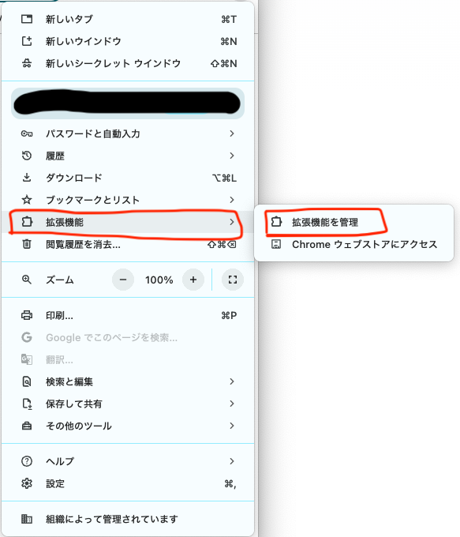
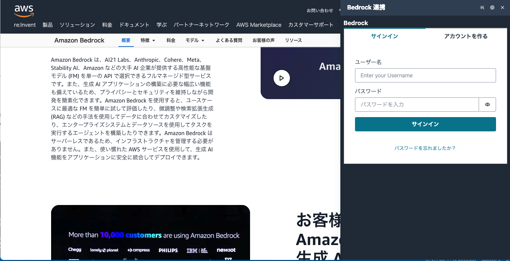

# Browser Extension Installation Instructions

Browser extensions become available after installing them in your browser. Here, we explain the installation procedure for browsers.

## Installation Target

- If you built it yourself
  - All contents under the `browser-extension/dist/` folder, which is the build output, are the installation target.
- If you are using a distributed zip file or other compressed file
  - Extract the compressed file and save it to any location.
  - All contents under the extracted folder are the installation target.

## Installation Method

### For Google Chrome

Open the browser menu in the upper right corner and open the "Manage Extensions" screen.

After opening the "Extensions" management screen, turn the "Developer mode" to `ON`.

When "Developer mode" is turned `ON`, a button labeled "Load unpacked extension" will appear, so click on it.

A folder selection window will appear, so select the "Installation target" folder indicated in this procedure document.

Once installed, it will appear in the extensions list.

### For Microsoft Edge

Open the menu with the extensions button at the top of the screen and open the "Manage extensions" screen.

After opening the "Extensions" management screen, turn the "Developer mode" to `ON`.

When "Developer mode" is turned `ON`, a button labeled "Load unpacked" will appear, so click on it.

A folder selection window will appear, so select the "Installation target" folder indicated in this procedure document.

Once installed, it will appear in the extensions list.

## How to Use

If the installation is successful, when you select text on any website, a popup displaying "GenU Extension" will appear as shown below. By clicking on this, the selected text will be automatically copied and the extension will launch.

Depending on the structure of the website, the popup may not appear. In that case, right-click to display the menu and click "GenU Extension" to launch it. This operation will also automatically copy the selected text.

If you right-click without selecting any text, a menu displaying "Open GenU Extension" will appear. In this case, the extension will open without copying any text.

The login screen will be displayed at the first launch. It uses the same authentication as the GenU Web app, so please log in using the same login information as that.

## Uninstallation Method

### For Google Chrome

Open the "Extensions" management screen using the same procedure as the installation method. Click the "Remove" button for the extension you want to uninstall.

### For Microsoft Edge

Open the "Extensions" management screen using the same procedure as the installation method. Click the "Remove" button for the extension you want to uninstall.

