# Microsoft Entra ID and SAML Integration

This guide introduces the reference procedure for integrating Microsoft Entra ID (formerly Azure Active Directory) with SAML. Please modify the detailed parameters to match your environment.

# Preliminary Work

First, deploy GenU. After the initial deployment, you will set up SAML integration between Cognito and Entra ID.

Open the Outputs tab on the CloudFormation Stack screen and note the WebUrl.


Next, from the Resource tab, note the Physical ID of the Cognito user pool.

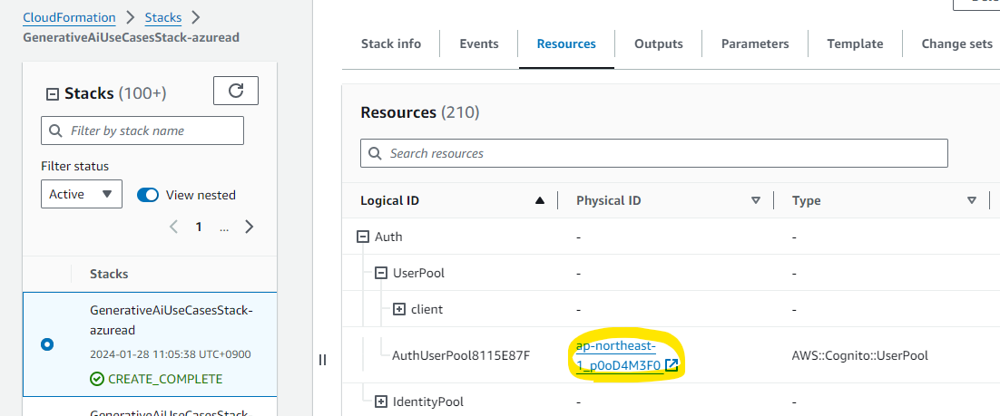

# Cognito Configuration: Domain Setup

Proceed with the Cognito domain configuration.
On the Cognito user pool screen, open the App integration tab and display the Domain screen. Since the Cognito Domain is blank, select Create Cognito domain from Actions.


Assign an appropriate name and press Create Cognito domain. In this procedure, we will use `your-preferred-name`. You need to use a globally unique name.

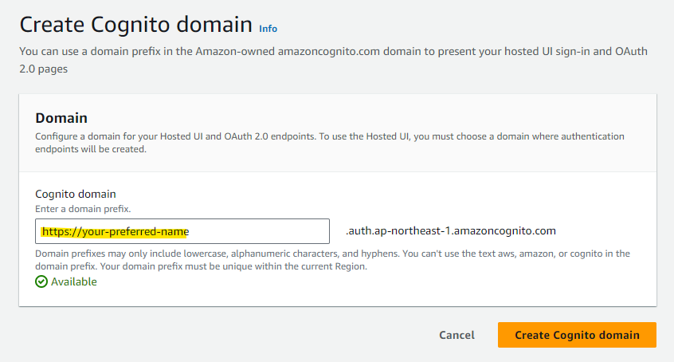

The Cognito domain has been configured.


# Microsoft Entra ID Configuration

Enable SAML integration in Microsoft Entra ID (formerly Azure Active Directory).

Open the Microsoft Entra ID configuration screen from Microsoft Azure.


Select Enterprise Applications.


Select New application.

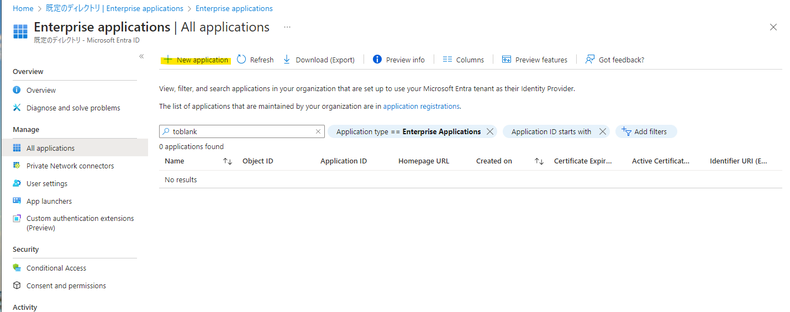

Select Create your own application.


Enter any application name and press Create. In this example, we are using `generative-ai-use-cases`.


From the Single sign-on menu, select SAML.


Press Edit in Basic SAML Configuration.


Enter the following parameters and press save. Use the Cognito user pool ID confirmed in [Preliminary Work](#preliminary-work) and the Domain value confirmed in [Cognito Configuration: Domain Setup](#cognito-configuration-domain-setup).

Identifier (Entity ID)

```
# Format
urn:amazon:cognito:sp:<UserPoolID>

# Example
urn:amazon:cognito:sp:ap-northeast-1_p0oD4M3F0
```

Reply URL (Assertion Consumer Service URL)

```
# Format
https://<your-entered-value>.auth.yourRegion.amazoncognito.com/saml2/idpresponse

# Example
https://your-preferred-name.auth.ap-northeast-1.amazoncognito.com/saml2/idpresponse
```

Specify the values and press Save.


The settings have been applied.


Select Download under Federation Metadata XML to obtain the XML file.

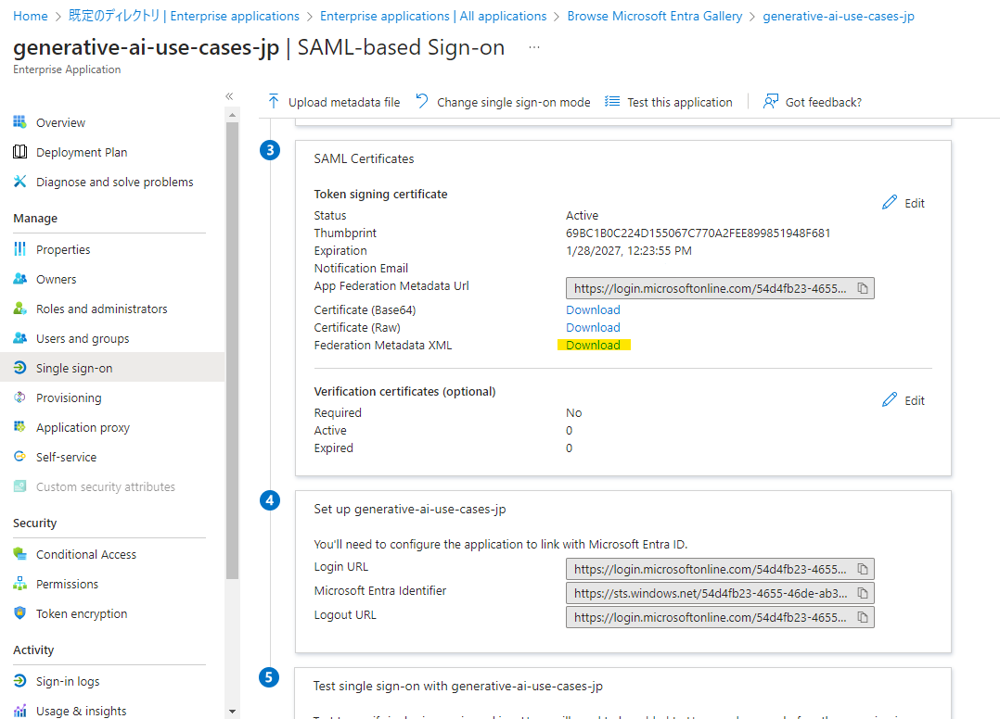

Add users or groups to be associated with this application. Only users and groups linked here will be able to log in.


In this example, we specify a user that was created in advance. Please specify according to your environment.


Press Assign.

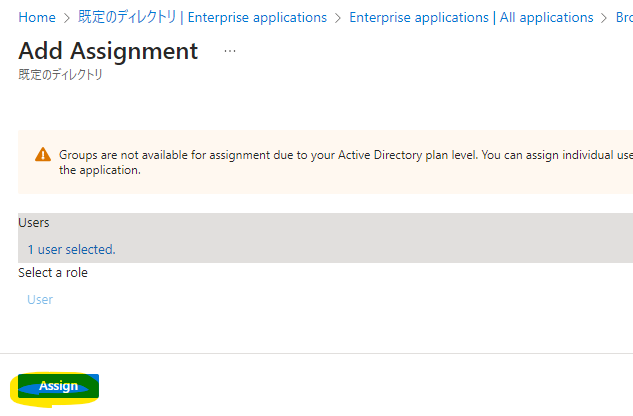

# Cognito Configuration: Federation

Return to the Cognito configuration in the AWS Management Console.
Open the Cognito User Pool screen, and from the Sign-in experience tab, select Add identity provider.


Select SAML as we are using SAML for integration with Entra ID.


Enter an easily identifiable name in the Provider name field. The Provider name specified here will be included in cdk.json in a later step.
Select Choose file and upload the "Federation Metadata XML" downloaded from Entra ID.

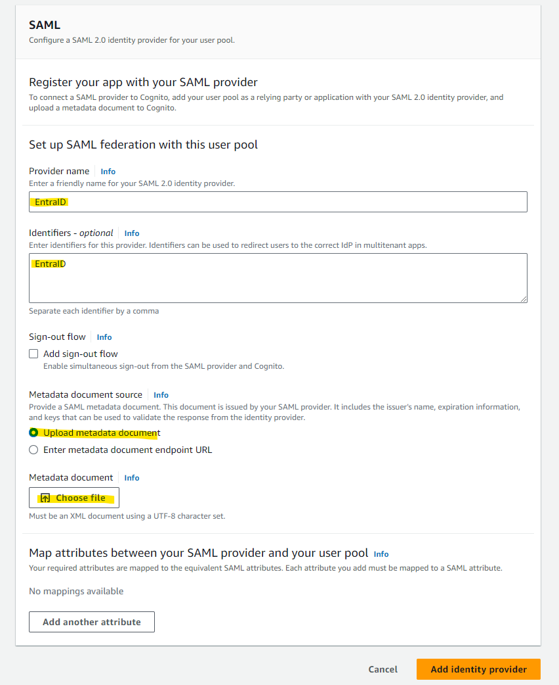

Specify email for User pool attribute.
For SAML attribute, select the following string and then select Add identity provider.

```
http://schemas.xmlsoap.org/ws/2005/05/identity/claims/emailaddress
```

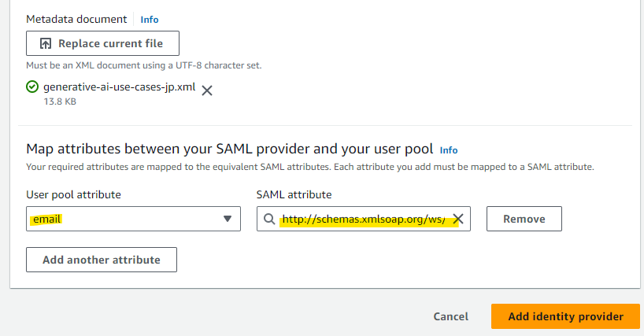

The configuration has been added.

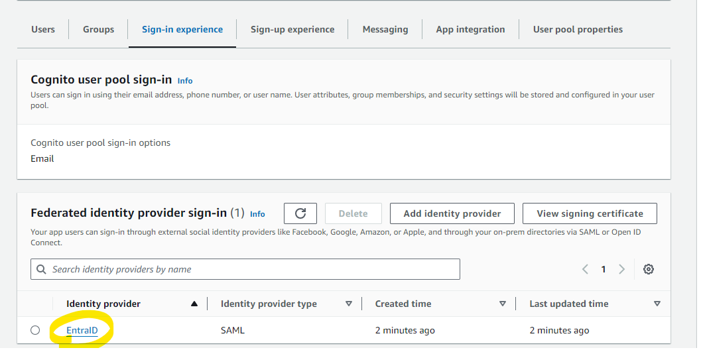

# Cognito Configuration: Hosted UI

Now we'll configure the Hosted UI to use the Entra ID integration. Select the App Integration tab.


Specify the existing App Client.


Press Edit.


Enter the WebUrl value confirmed in [Preliminary Work](#preliminary-work) into both Allowed callback URLs and Allowed sign-out URLs.
If you want to use a [local development environment](./DEVELOPMENT.md) for frontend development, also add `http://localhost:5173` to both Allowed callback URLs and Allowed sign-out URLs.


Select EntraID for Identity Provider. Also, since we want to stop authentication using the Cognito user pool, uncheck the Cognito user pool checkbox.

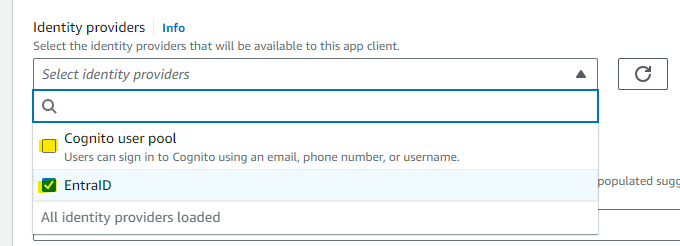

Press Save changes.


The configuration has been added.

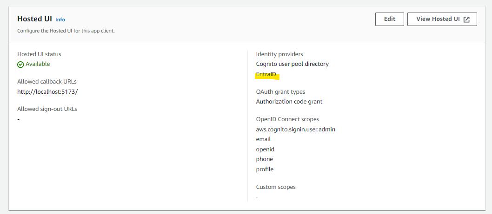

# Editing cdk.json

Now that the configuration is complete, modify the values in cdk.json.

- samlAuthEnabled: Specify `true`. This switches to a SAML-specific authentication screen, and the conventional authentication function using Cognito user pools will no longer be available.
- samlCognitoDomainName: Enter the Cognito Domain name specified in ["Cognito Configuration: Domain Setup"](#cognito-configuration-domain-setup).
- samlCognitoFederatedIdentityProviderName: Enter the Identity Provider name configured in ["Cognito Configuration: Federation"](#cognito-configuration-federation).

```json
  "context": {
　　 <omitted>
    "samlAuthEnabled": true,
    "samlCognitoDomainName": "your-preferred-name.auth.ap-northeast-1.amazoncognito.com",
    "samlCognitoFederatedIdentityProviderName": "EntraID",
```

After configuration, deploy again to enable SAML integration.

---

# (Optional) SAML IdP Group Custom Attribute Configuration

This section introduces how to map Roles or Groups managed in SAML IdP to Cognito Attributes for RAG filtering.

First, in the Entra ID Enterprise Application screen, select Edit in Attributes & Claims to edit.


Add a Group Claim from Add a group claim. Select the scope of groups to share with the application according to your requirements. (Details can be found [here](https://learn.microsoft.com/en-us/entra/identity/hybrid/connect/how-to-connect-fed-group-claims))


Next, on the Cognito User Pool screen, open the Custom attributes addition screen from Sign-up.

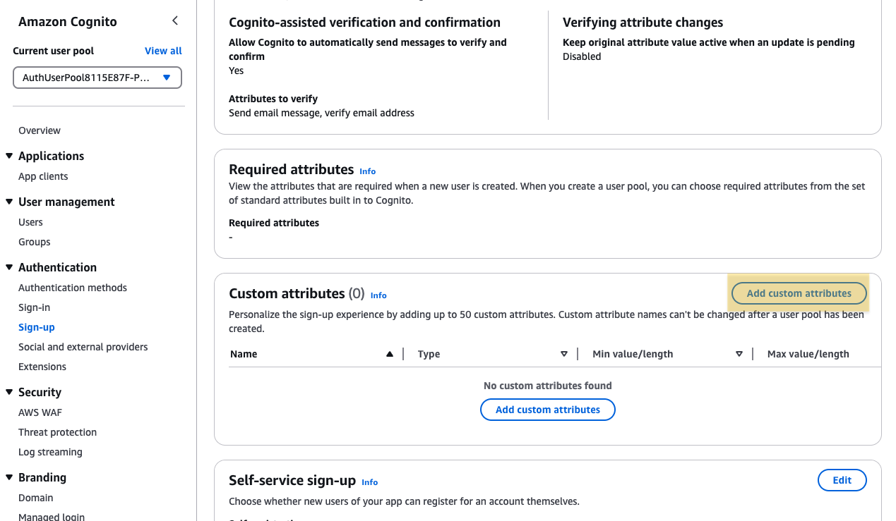

Create a Custom Attribute with an appropriate name. In this example, we are using `idpGroup`.


Next, open the Attribute mapping screen in the Social Identity Provider screen.


Map the Custom Attribute name created earlier with the Entra ID Group Claim `http://schemas.microsoft.com/ws/2008/06/identity/claims/groups`.

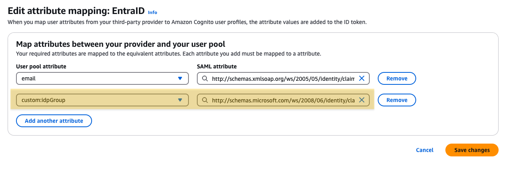

This completes the mapping of Groups defined in Entra ID to Cognito Attributes.

Since Custom Attributes are included in the ID token, they can now be used by the application.

To use it for Knowledge Base RAG filtering, uncomment `Example2` in the `getDynamicFilters` function in `packages/common/src/custom/rag-knowledge-base.ts`.

```typescript
// Example 2: Filter by SAML IdP group custom attribute (Check steps to setup attribute mapping in docs/SAML_WITH_ENTRA_ID.md)

const groups = (idTokenPayload['custom:idpGroup'] as string) // storing group as string (i.e. [group1id, group2id])
  .slice(1, -1) // remove the first and last brackets
  .split(/, ?/) // split by comma and optional space
  .filter(Boolean); // remove empty strings
if (!groups) throw new Error('custom:idpGroup is not set'); // Error if Group is not set, preventing access
const groupFilter: RetrievalFilter = {
  in: {
    key: 'group',
    value: groups,
  },
};
dynamicFilters.push(groupFilter);
```

Filtering will be applied when the document's group metadata specifies the Object ID of the user's IdP group.

Similarly, other metadata can also be utilized using Cognito Custom Attributes and Attribute Mapping.
