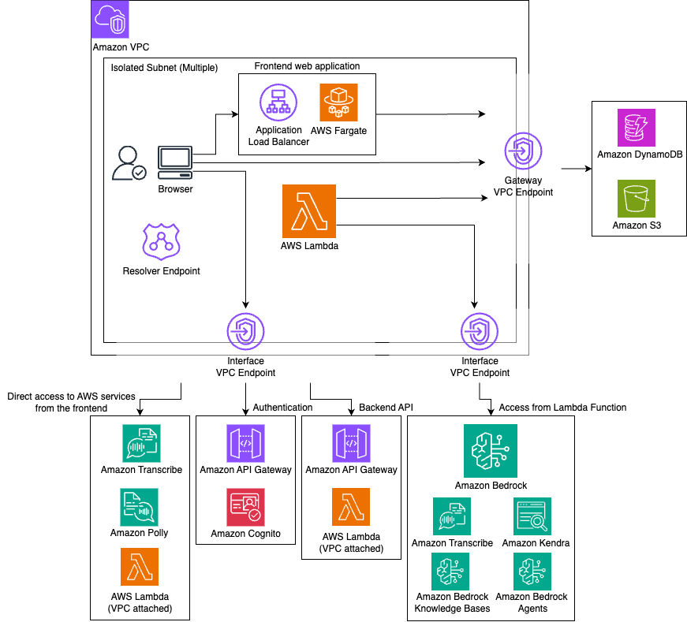

# 閉域ネットワーク環境での GenU AWS 構成ドキュメント

## 目次

1. [概要](#概要)
2. [アーキテクチャ図](#アーキテクチャ図)
3. [主要なAWSサービスコンポーネント](#主要なawsサービスコンポーネント)
4. [ネットワーク構成](#ネットワーク構成)
5. [セキュリティ構成](#セキュリティ構成)
6. [オンプレミスからの接続要件](#オンプレミスからの接続要件)
7. [デプロイ設定例](#デプロイ設定例)
8. [リソース一覧](#リソース一覧)

---

## 概要

このドキュメントでは、Generative AI Use Cases JP (GenU) を閉域ネットワーク環境で構築する際のAWS構成について説明します。

### 閉域モードの特徴

`closedNetworkMode` を `true` に設定することで、以下の特徴を持つ閉域ネットワーク構成が実現されます：

- **インターネットからの分離**: クライアントからGenUへの通信は完全にVPC内で完結
- **VPC Endpoint経由の通信**: AWS Lambda から他のAWSサービス（DynamoDB、S3、Bedrockなど）への通信はすべてVPC Endpoint経由
- **プライベートな配信**: Amazon CloudFrontを使用せず、Application Load Balancer (ALB) + ECS Fargateで静的ファイルを配信
- **Cognito接続**: Amazon Cognito へは専用のAPI Gateway プロキシ経由でアクセス

### 適用シナリオ

- 社内ネットワーク（オンプレミス）からのみアクセスさせたい場合
- 高いセキュリティ要件がある企業環境
- インターネットへの接続を制限したい環境

---

## アーキテクチャ図



### アーキテクチャの主要構成要素

```
[クライアント (Browser)]
    ↓ (オンプレミスまたは VPC内)
[Resolver Endpoint] (DNS解決)
    ↓
[Application Load Balancer] (内部向け)
    ↓
[ECS Fargate] (静的ファイル配信)
    ↓
[Gateway VPC Endpoint] → Amazon S3
    ↓
[API Gateway] (VPC Endpoint経由)
    ↓
[AWS Lambda] (VPC配置)
    ↓
[Interface VPC Endpoints] → DynamoDB, Bedrock, Transcribe, Polly, Kendra等
```

---

## 主要なAWSサービスコンポーネント

### 1. ネットワーク層

#### Amazon VPC
- **役割**: すべてのリソースを格納する仮想ネットワーク
- **構成**:
  - 新規作成または既存VPCのインポートが可能
  - デフォルトCIDR: `10.0.0.0/16`
  - Isolated Subnet (Private Isolated) を使用
  - 最小2つのAvailability Zone (AZ) に跨る構成
- **関連ファイル**: `packages/cdk/lib/construct/closedNetwork/closed-vpc.ts`

#### VPC Endpoints

**Gateway Endpoints:**
- **Amazon S3**: 静的ファイルやデータの保存・取得
- **Amazon DynamoDB**: 会話履歴、ユーザー情報等の管理

**Interface Endpoints:**
| エンドポイント | 用途 |
|--------------|------|
| API Gateway | メインAPI、Cognito認証プロキシ |
| Lambda | ストリーミング出力 |
| Bedrock Runtime | 生成AIモデルの推論実行 |
| Bedrock Agent Runtime | エージェント機能の実行 |
| Bedrock Agent | エージェントの管理API |
| Bedrock AgentCore | AgentCore Runtime の実行 |
| Amazon Transcribe | 音声からテキストへの変換 |
| Amazon Transcribe Streaming | リアルタイム音声認識 |
| Amazon Polly | テキストから音声への変換 |
| Amazon Kendra | RAG用のエンタープライズ検索 |
| ECR / ECR Docker | Fargateコンテナイメージの取得 |
| CloudWatch Logs | ログの収集と保存 |
| STS | 一時的な認証情報の取得 |

### 2. フロントエンド配信層

#### Application Load Balancer (ALB)
- **役割**: Web静的ファイル配信の入り口
- **構成**:
  - 内部向け (Internet-facing: false)
  - Isolated Subnet に配置
  - HTTPS対応（証明書インポート時）またはHTTP
- **エンドポイント**:
  - カスタムドメイン設定時: `https://<your-domain>`
  - デフォルト: `http://internal-<xxx>.<region>.elb.amazonaws.com`

#### Amazon ECS Fargate
- **役割**: S3からファイルを読み込み、HTTPサーバーとして配信
- **構成**:
  - CPU: 256
  - メモリ: 512 MiB
  - 初期タスク数: 1
  - 最大タスク数: 20（オートスケーリング）
  - コンテナポート: 8080
- **オートスケーリング**:
  - CPU使用率 50%
  - メモリ使用率 50%
- **関連ファイル**:
  - `packages/cdk/lib/construct/closedNetwork/closed-web.ts`
  - `packages/cdk/fargate-s3-server/app.ts`

#### Amazon S3 (Web Bucket)
- **役割**: React等のフロントエンドビルド成果物の保存
- **セキュリティ**:
  - パブリックアクセスブロック: 有効
  - 暗号化: S3マネージド暗号化
  - SSL/TLS接続の強制

### 3. 認証層

#### Amazon Cognito (User Pool & Identity Pool)
- **役割**: ユーザー認証・認可
- **アクセス方法**: 閉域環境では直接アクセス不可のため、プライベートAPI Gatewayを経由
- **制約**: SAML認証は利用不可

#### Cognito プライベートプロキシ (API Gateway)
- **役割**: VPC内からCognitoへの接続を仲介
- **構成**:
  - **User Pool Proxy API**:
    - エンドポイント: `https://<xxx>.execute-api.<region>.amazonaws.com`
    - 認証リクエストのプロキシ
    - JWKS (JSON Web Key Set) の取得
  - **Identity Pool Proxy API**:
    - エンドポイント: `https://<yyy>.execute-api.<region>.amazonaws.com`
    - 一時認証情報の取得
- **セキュリティ**:
  - Private API Gateway (VPC Endpoint経由のみアクセス可能)
  - リソースポリシーでVPC Endpointからのアクセスのみ許可
  - CORS設定
- **関連ファイル**: `packages/cdk/lib/construct/closedNetwork/cognito-private-proxy.ts`

### 4. バックエンドAPI層

#### Amazon API Gateway (メインAPI)
- **役割**: Lambda関数へのRESTful APIエンドポイント提供
- **構成**:
  - 閉域モード: VPC Endpoint経由でのアクセス
  - エンドポイント: `https://<zzz>.execute-api.<region>.amazonaws.com`
- **統合機能**:
  - チャット機能
  - RAG (Retrieval-Augmented Generation)
  - 文章生成・要約・翻訳
  - 画像生成・動画生成
  - 音声認識・文字起こし
  - エージェント機能

#### AWS Lambda
- **役割**: ビジネスロジックの実行
- **構成**:
  - VPC配置 (閉域モード時)
  - Security Group設定
  - VPC Endpoint経由で各種AWSサービスにアクセス
- **主要な関数**:
  - `predict` / `predictStream`: LLMとの対話
  - `generateImage` / `generateVideo`: 画像・動画生成
  - `agent`: Bedrock Agentの実行
  - `retrieveKnowledgeBase` / `queryKendra`: RAG検索
  - `getTranscription`: 音声認識

### 5. データ層

#### Amazon DynamoDB
- **役割**: 会話履歴、ユーザー設定、システムコンテキスト等の保存
- **テーブル**:
  - メインテーブル: チャット履歴、メッセージ、共有設定
  - 統計テーブル: トークン使用量等の統計情報
- **アクセス**: Gateway VPC Endpoint経由

#### Amazon S3 (データバケット)
- **役割**:
  - ユーザーアップロードファイル
  - RAG用ドキュメント (Knowledge Base データソース)
  - 生成された画像・動画
  - 音声ファイル
- **アクセス**: Gateway VPC Endpoint経由

### 6. AI/ML サービス層

#### Amazon Bedrock
- **役割**: 基盤モデル (Foundation Models) へのアクセス
- **利用モデル例**:
  - Claude 3.5 Sonnet / Opus / Haiku (Anthropic)
  - Amazon Nova Canvas (画像生成)
  - Amazon Nova Reel (動画生成)
- **アクセス**: Interface VPC Endpoint経由
- **制約**: 閉域モードではアプリのリージョンとモデルのリージョンは同一である必要がある

#### Amazon Bedrock Knowledge Bases
- **役割**: RAG (Retrieval-Augmented Generation) の情報ソース
- **機能**:
  - Advanced Parsing
  - チャンク戦略の選択
  - クエリ分解
  - リランキング
  - メタデータフィルター

#### Amazon Kendra (オプション)
- **役割**: エンタープライズ検索エンジン (RAGの情報ソース)
- **アクセス**: Interface VPC Endpoint経由

#### Amazon Transcribe / Transcribe Streaming
- **役割**: 音声認識、文字起こし
- **アクセス**: Interface VPC Endpoint経由

#### Amazon Polly
- **役割**: テキスト読み上げ
- **アクセス**: Interface VPC Endpoint経由

### 7. DNS解決

#### Route53 Resolver Endpoint (Inbound)
- **役割**: オンプレミス環境からのDNSクエリをVPC内で解決
- **構成**:
  - 方向: INBOUND
  - 最小2つのサブネット (異なるAZ)
  - セキュリティグループ: TCP/UDP 53番ポートを許可
- **IP アドレス**: マネジメントコンソールから確認可能
- **関連ファイル**: `packages/cdk/lib/construct/closedNetwork/resolver.ts`

#### Route53 Private Hosted Zone (オプション)
- **役割**: カスタムドメイン名の解決
- **構成**: VPCに関連付け
- **設定例**: `genu.closed` → ALBのIPアドレス

### 8. 検証環境 (オプション)

#### Amazon EC2 (Windows)
- **役割**: 閉域環境での動作確認用
- **アクセス方法**: Fleet Manager経由でRDP接続
- **認証**: EC2 Key Pair (SSM Parameter Storeに保存)
- **注意**: 検証後は手動停止が必要（自動停止なし）

---

## ネットワーク構成

### サブネット設計

```
VPC (10.0.0.0/16)
├─ Isolated Subnet 1 (AZ-a)
│  ├─ ALB ENI
│  ├─ Fargate Tasks
│  ├─ VPC Endpoints
│  └─ Resolver Endpoint
│
└─ Isolated Subnet 2 (AZ-b)
   ├─ ALB ENI
   ├─ Fargate Tasks
   ├─ VPC Endpoints
   └─ Resolver Endpoint
```

### トラフィックフロー

#### 1. ユーザーアクセスフロー
```
[ブラウザ]
  → [Resolver Endpoint] (DNS解決)
  → [ALB]
  → [Fargate]
  → [S3 Gateway Endpoint]
  → [S3 Bucket]
```

#### 2. API呼び出しフロー
```
[ブラウザ]
  → [API Gateway VPC Endpoint]
  → [API Gateway]
  → [Lambda (VPC内)]
  → [Bedrock/DynamoDB/S3 VPC Endpoint]
  → [各種AWSサービス]
```

#### 3. 認証フロー
```
[ブラウザ]
  → [API Gateway VPC Endpoint]
  → [Cognito Proxy API Gateway]
  → [Amazon Cognito]
```

### ルーティングテーブル

**Isolated Subnet:**
- ローカルトラフィック: VPC CIDR (`10.0.0.0/16`)
- S3: Gateway Endpoint経由
- DynamoDB: Gateway Endpoint経由
- その他AWSサービス: Interface VPC Endpoint経由
- インターネット: **アクセス不可**

---

## セキュリティ構成

### セキュリティグループ

#### 1. VPC Endpoint セキュリティグループ
```yaml
Ingress:
  - Protocol: TCP
    Port: 443
    Source: VPC CIDR (10.0.0.0/16)
```

#### 2. Transcribe Streaming セキュリティグループ
```yaml
Ingress:
  - Protocol: TCP
    Port: 443
    Source: VPC CIDR (10.0.0.0/16)
  - Protocol: TCP
    Port: 8443
    Source: VPC CIDR (10.0.0.0/16)
```

#### 3. Lambda セキュリティグループ
```yaml
Egress:
  - Protocol: All
    Destination: 0.0.0.0/0
```

#### 4. Resolver セキュリティグループ
```yaml
Ingress:
  - Protocol: TCP
    Port: 53
    Source: 0.0.0.0/0
  - Protocol: UDP
    Port: 53
    Source: 0.0.0.0/0
Egress:
  - Protocol: All
    Destination: 0.0.0.0/0
```

### IAMロール・ポリシー

- **Lambda実行ロール**: Bedrock、DynamoDB、S3等へのアクセス権限
- **Fargate タスクロール**: S3からの読み取り権限
- **API Gateway**: Lambdaの呼び出し権限

### データ暗号化

- **S3**: サーバーサイド暗号化 (SSE-S3)
- **DynamoDB**: 保管時の暗号化
- **通信**: すべてのVPC Endpoint間の通信はTLS/SSL

---

## オンプレミスからの接続要件

### 前提条件

1. **ネットワーク接続の確立**:
   - AWS Direct Connect
   - Site-to-Site VPN
   - その他のプライベート接続

2. **DNS設定**: Route53 Resolver Endpointの利用

### 名前解決が必要なエンドポイント

| サービス名 | エンドポイント | 役割 |
|-----------|---------------|------|
| Application Load Balancer | `<custom-domain>` または `internal-<xxx>.<region>.elb.amazonaws.com` | Web静的ファイル |
| API Gateway (メインAPI) | `<xxx>.execute-api.<region>.amazonaws.com` | バックエンドAPI |
| API Gateway (Cognito User Pool) | `<yyy>.execute-api.<region>.amazonaws.com` | 認証プロキシ |
| API Gateway (Cognito Identity Pool) | `<zzz>.execute-api.<region>.amazonaws.com` | 認証プロキシ |
| Lambda | `lambda.<region>.amazonaws.com` | ストリーミング |
| Transcribe | `transcribe.<region>.amazonaws.com` | 文字起こし |
| Transcribe Streaming | `transcribestreaming.<region>.amazonaws.com` | リアルタイム文字起こし |
| Polly | `polly.<region>.amazonaws.com` | 音声合成 |
| Bedrock AgentCore | `bedrock-agentcore.<region>.amazonaws.com` | AgentCore実行 |

### DNS設定方法

#### オプション1: Resolver Endpoint を使用（推奨）

オンプレミスのDNSサーバーに以下を設定：

```
# 各エンドポイントのフォワーダーとして Resolver Endpoint のIPアドレスを指定
<xxx>.execute-api.ap-northeast-1.amazonaws.com -> 10.0.1.100, 10.0.2.100
<yyy>.execute-api.ap-northeast-1.amazonaws.com -> 10.0.1.100, 10.0.2.100
lambda.ap-northeast-1.amazonaws.com -> 10.0.1.100, 10.0.2.100
transcribe.ap-northeast-1.amazonaws.com -> 10.0.1.100, 10.0.2.100
...
```

**簡略的な設定（推奨しない）:**
```
# amazonaws.com 全体をフォワード（副作用が大きい）
*.amazonaws.com -> 10.0.1.100, 10.0.2.100
```

#### オプション2: /etc/hosts を使用（検証のみ）

**注意**: 冗長性がなく、IPアドレスが変わる可能性があるため、本番環境では非推奨

```bash
# /etc/hosts
10.0.1.50  xxx.execute-api.ap-northeast-1.amazonaws.com
10.0.1.51  yyy.execute-api.ap-northeast-1.amazonaws.com
...
```

### IPアドレスの確認方法

#### Resolver Endpoint のIPアドレス
1. [Route53 コンソール](https://console.aws.amazon.com/route53resolver) を開く
2. "Inbound endpoints" を選択
3. 作成したエンドポイントをクリック
4. IPアドレスを確認

#### VPC Endpoint のIPアドレス
1. [VPC コンソール](https://console.aws.amazon.com/vpcconsole/home) を開く
2. "Endpoints" を選択
3. 該当サービスのエンドポイントをクリック
4. ページ下部のサブネットとIPアドレスを確認

#### ALB のIPアドレス
1. [EC2 コンソール](https://console.aws.amazon.com/ec2/home) を開く
2. "Network Interfaces" を選択
3. "elb" で検索し、Security group names が `ClosedNetworkStack...` のENIを選択
4. Private IPv4 address を確認

---

## デプロイ設定例

### cdk.json 設定例

```json
{
  "app": "npx ts-node --prefer-ts-exts bin/generative-ai-use-cases.ts",
  "context": {
    "dev": {
      "region": "ap-northeast-1",
      "modelRegion": "ap-northeast-1",
      "modelIds": ["apac.anthropic.claude-sonnet-4-20250514-v1:0"],
      "imageGenerationModelIds": ["amazon.nova-canvas-v1:0"],
      "videoGenerationModelIds": ["amazon.nova-reel-v1:0"],
      "speechToSpeechModelIds": [],

      "ragEnabled": true,
      "ragKnowledgeBaseEnabled": true,
      "agentEnabled": true,
      "mcpEnabled": true,
      "guardrailEnabled": true,
      "useCaseBuilderEnabled": true,

      "closedNetworkMode": true,
      "closedNetworkVpcIpv4Cidr": "10.0.0.0/16",
      "closedNetworkCreateResolverEndpoint": true,
      "closedNetworkCreateTestEnvironment": true
    }
  }
}
```

### パラメータ詳細

| パラメータ | 説明 | デフォルト |
|-----------|------|----------|
| `closedNetworkMode` | 閉域モードの有効化 | `false` |
| `closedNetworkVpcIpv4Cidr` | 新規VPCのCIDR | `10.0.0.0/16` |
| `closedNetworkVpcId` | 既存VPCをインポートする場合のVPC ID | なし (新規作成) |
| `closedNetworkSubnetIds` | リソースをデプロイするサブネットIDの配列（2つ以上） | なし (Isolatedサブネットを自動選択) |
| `closedNetworkCertificateArn` | カスタムドメイン用のACM証明書ARN | なし (HTTPのみ) |
| `closedNetworkDomainName` | カスタムドメイン名 | なし |
| `closedNetworkCreateTestEnvironment` | 検証用Windows EC2を作成 | `true` |
| `closedNetworkCreateResolverEndpoint` | Resolver Endpointを作成 | `true` |

### カスタムドメイン設定例

```json
{
  "context": {
    "prod": {
      "closedNetworkMode": true,
      "closedNetworkDomainName": "genu.internal.example.com",
      "closedNetworkCertificateArn": "arn:aws:acm:ap-northeast-1:123456789012:certificate/xxxxxxxx-xxxx-xxxx-xxxx-xxxxxxxxxxxx",
      "closedNetworkVpcId": "vpc-xxxxxxxxxxxxxxxxx",
      "closedNetworkSubnetIds": [
        "subnet-xxxxxxxxxxxxxxxxx",
        "subnet-yyyyyyyyyyyyyyyyy"
      ]
    }
  }
}
```

### 証明書の準備

#### 自己署名証明書（検証用のみ）

```bash
# 秘密鍵の生成
openssl genrsa 2048 > ssl.key

# CSRの生成 (Common NameにドメインNom指定)
openssl req -new -key ssl.key > ssl.csr

# 証明書の発行（10年有効）
openssl x509 -days 3650 -req -signkey ssl.key < ssl.csr > ssl.crt
```

#### ACMへのインポート

1. [AWS Certificate Manager](https://console.aws.amazon.com/acm/home) を開く
2. "Import certificate" をクリック
3. Certificate body: `ssl.crt` の内容
4. Certificate private key: `ssl.key` の内容
5. "Import" をクリック

---

## リソース一覧

### コンピューティング
- AWS Lambda (VPC配置)
- Amazon ECS Fargate
- Amazon EC2 (検証用Windows)

### ネットワーク
- Amazon VPC
- Isolated Subnets (複数AZ)
- Application Load Balancer (内部)
- VPC Endpoints (Gateway × 2, Interface × 13以上)
- Route53 Resolver Endpoint (Inbound)
- Route53 Private Hosted Zone
- Security Groups

### ストレージ
- Amazon S3 (Web用、データ用)
- Amazon DynamoDB

### AI/ML
- Amazon Bedrock (Runtime, Agent, Knowledge Bases)
- Amazon Transcribe / Transcribe Streaming
- Amazon Polly
- Amazon Kendra (オプション)

### アプリケーション統合
- Amazon API Gateway (REST API × 3)

### セキュリティ・認証
- Amazon Cognito (User Pool, Identity Pool)
- AWS IAM
- AWS Certificate Manager

### 管理・モニタリング
- Amazon CloudWatch Logs
- AWS Systems Manager (Parameter Store, Fleet Manager)

### コンテナ
- Amazon ECR
- Amazon ECS

---

## 関連ドキュメント

- [閉域モード設定ガイド (CLOSED_NETWORK.md)](./CLOSED_NETWORK.md)
- [デプロイオプション](./DEPLOY_OPTION.md)
- [デプロイ手順](./DEPLOY_ON_AWS.md)
- [メインREADME](../../README_ja.md)

---

## 制約事項

1. **デプロイ環境**: デプロイ自体はインターネット接続が必要
2. **リージョン制約**: アプリのリージョンとモデルのリージョンは同一である必要がある
3. **SAML認証**: 利用不可
4. **音声チャット**: 現状利用不可
5. **クロスリージョン**: 他リージョンのBedrockモデルは利用不可

---

## まとめ

閉域ネットワーク構成により、GenUを完全にプライベートな環境で運用することが可能です。VPC Endpointを活用することで、インターネットへの接続なしにAWSの各種サービスを利用でき、高いセキュリティ要件を満たすことができます。

オンプレミス環境からの接続にはDirect ConnectやVPN、適切なDNS設定が必要となりますが、Resolver Endpointを活用することで柔軟な名前解決が実現できます。

本ドキュメントの情報を基に、貴社の要件に合わせた閉域ネットワーク構成をご検討ください。
