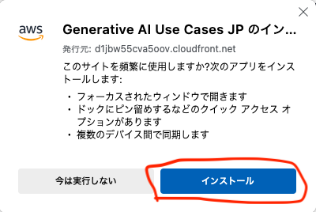
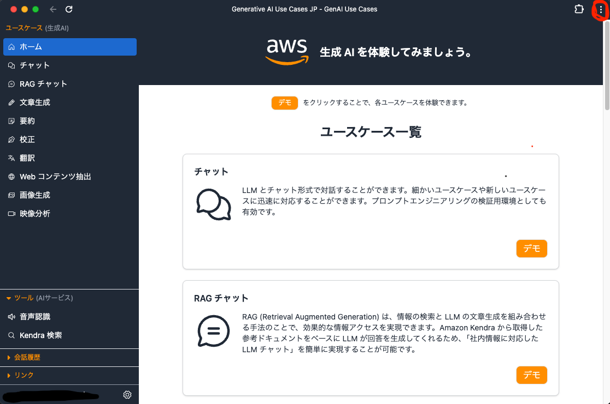

# ネイティブアプリのように利用する方法

GenU は、PWA（Progressive Web Application）という技術を使ってネイティブアプリのようにインストールして利用することが可能です（もちろん、インストールせずにブラウザから直接利用することも可能です）。

PWA はブラウザの機能を利用して動作するので、ブラウザからインストールを行います。代表的な 2 つのブラウザについて、利用方法を解説します。

## インストール方法

### Google Chrome の場合

まずは、デプロイした Web の URL にアクセスしてください。アクセスすると、下記の画面のようにインストールボタンが表示されるので、クリックしてインストールをしてください。

インストールが完了すると、以下のようにブラウザから独立して GenU を実行することが可能になります。

### Microsoft Edge の場合

まずは、デプロイした Web の URL にアクセスしてください。アクセスすると、下記の画面のようにインストールボタンが表示されるので、クリックしてインストールをしてください。

インストールが完了すると、以下のようにブラウザから独立して GenU を実行することが可能になります。

## アンインストール方法

PWA をアンインストールしても、通常の Web アプリのようにブラウザからアクセスして引き続き利用することが可能です。

### Google Chrome の場合

まず、インストールした PWA を開いてください。右上のアプリケーションメニューから「Generative AI Use Cases」をアンインストールをクリックして、アンインストールしてください。

### Microsoft Edge の場合

まず、インストールした PWA を開いてください。右上のアプリケーションメニューから「アプリの設定」クリックして、設定画面を開いてください。設定画面内の「アンインストール」をクリックして、アンインストールをしてください。

