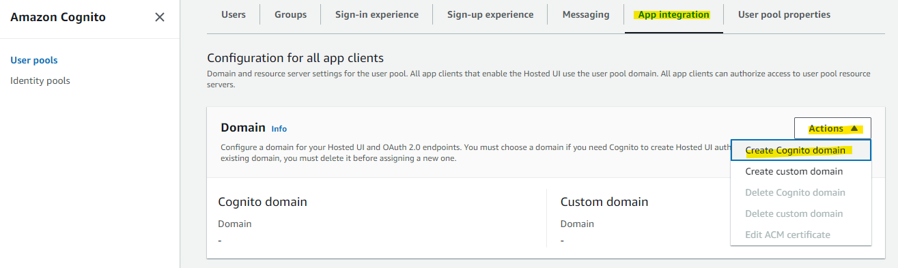
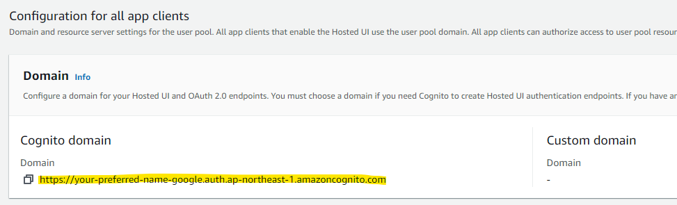
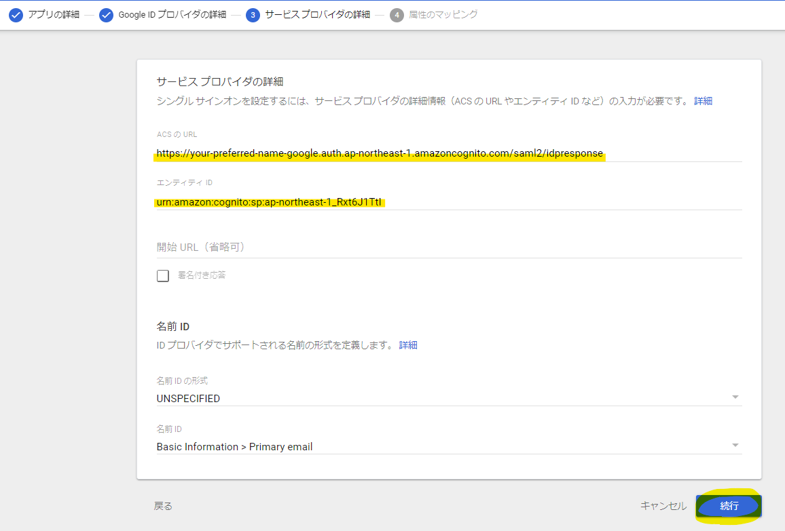
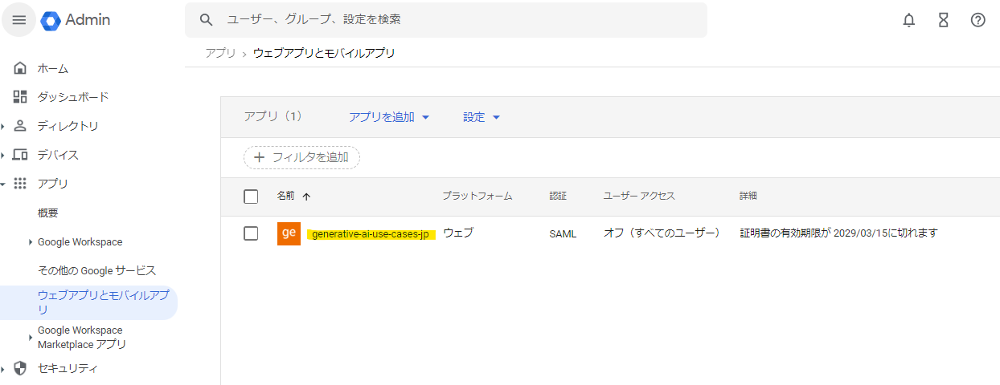
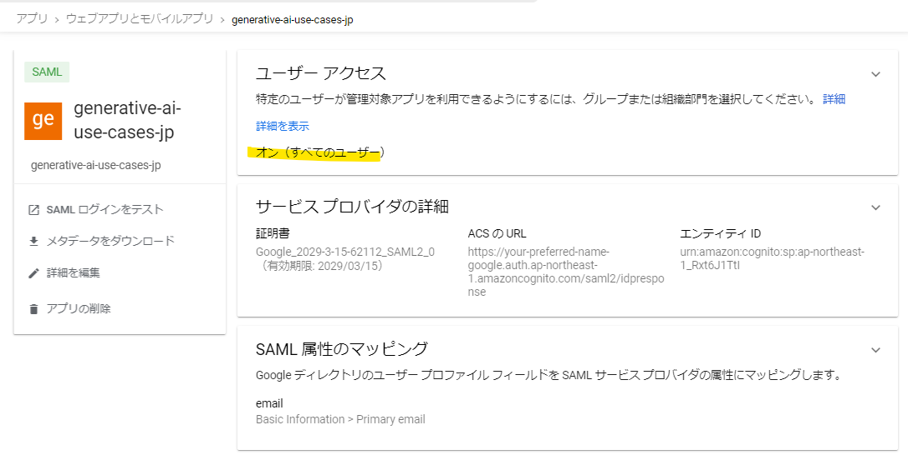
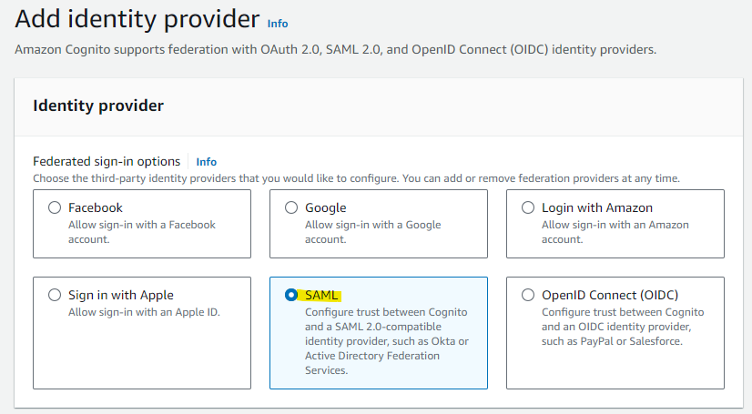
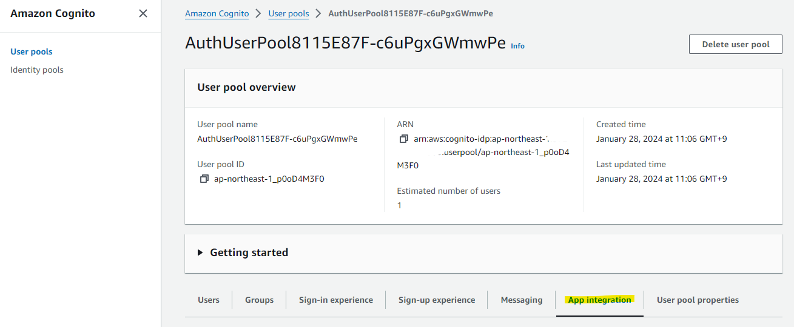
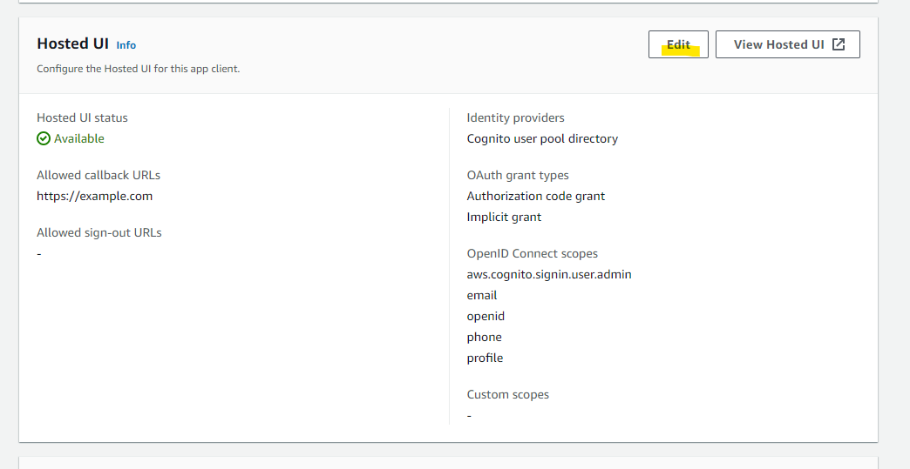

# Google Workspace と SAML 連携

Google Workspace と SAML 連携を行う参考手順を紹介します。詳細なパラメーターは各環境に合わせて変更してください。

# 事前作業

GenU の初回デプロイを行います。初回デプロイを行ったあと、Cognito と Google Workspace の SAML 連携を行います。

CloudFormation の Stack の画面で Outputs タブを開き、WebUrl をメモします。


次に、Resource タブから、Cognito user pool の Physical ID をメモします。


# Cognito の設定 : Domain 設定

Cognito domain の設定を進めます。
Cognito user pool の画面で、App integration タブを開き、Domain に関する画面を表示します。Cognito Domain が空白なので、Actions から Create Cognito domain を選択します。



適当に任意の名前を付け、Create Cognito domain を押します。この手順では、`your-preferred-name-google` とします。世界で一意の名前を付ける必要があります。


Cognito domain が設定されました。



# Google Workspace の設定 : SAML アプリケーション

以下の URL から Google Workspace の管理画面を開き、SAML の設定を進めていきます。
https://admin.google.com/u/0/ac/home

アプリケーションの設定画面から、カスタム SAML アプリの追加を押します。


Google Workspace の管理上の名前を入れます。任意の名前で大丈夫です。今回は `generative-ai-use-cases` と入れます。


メタデータをダウンロードボタンを押して、`GoogleIDPMetadata.xml` をダウンロードしたあと、続行ボタンを押します。


以下のパラメーターを指定します。「事前設定」で確認した User Pool の ID や、「Cognito の設定 : Domain 設定」で設定したドメイン名を指定します。

ACS の URL

```
# フォーマット
https://<入力した値>.auth.yourRegion.amazoncognito.com/saml2/idpresponse

# 入力例
https://your-preferred-name-google.auth.ap-northeast-1.amazoncognito.com/saml2/idpresponse
```

エンティティ ID

```
# フォーマット
urn:amazon:cognito:sp:<UserPoolID>

# 入力例
urn:amazon:cognito:sp:ap-northeast-1_Rxt6J1TtI
```

以下が入力した例です。入力したあと、続行ボタンを押します。



属性で、Google Directory 上の属性を、どのように Cognito 側と連携するか設定します。`Primary email` に `email` と指定します。その後、完了ボタンを押します。


アプリケーションが設定されました。



# Google Workspace : アクセス許可設定

作成したアプリケーションの詳細画面を開いて、アクセス許可の設定を行います。詳細画面から「オフ (すべてのユーザー)」の箇所をクリックします。


このサンプル手順では、「会社全体」という組織に所属するユーザーに対してアクセス許可を行います。会社全体に対して「オン」を選択し、オーバーライドを押します。  
このアクセス許可の設定は、各環境に合わせて細かく設定することが出来るので、組織内のポリシーに基づいて変更してください。


オンに変わりました。



# Cognito の設定 : Federation

AWS マネジメントコンソールで Cognito の設定作業に戻ります。
Cognito User Pool の画面を開き、Sign-in experience タブから、Add identity provider を選択します。


Google Workspace の連携で SAML を利用するため、SAML を選択します。**Google は選択せずに、SAML を選択します。**



Provider name に任意の識別しやすい名前を入れます。ここで指定した Provider name を、後の手順で cdk.json に記載します。
Choose file を選び、Google Workspace からダウンロードしてきた「GoogleIDPMetadata.xml」をアップロードします。


User pool attribute の email を指定します。
SAML attribute に、`email` 入力して、Add identity provider を選択します。


設定が追加されました。


# Cognito の設定 : Hosted UI

Google Workspace との連携を Hosted UI で利用するための設定をしていきます。App Integration タブを選択します。



既存の App Client を指定します。


Edit を押します。



[事前作業](#事前作業)で確認した WebUrl の値を Allowed callback URLs と Allowed sign-out URLs に入力します。
[ローカル開発環境](./DEVELOPMENT.md) を利用してフロントエンドの開発を行いたい場合は、`http://localhost:5173` も Allowed callback URLs と Allowed sign-out URLs に追加で入力します。


Identity Provider で `GoogleWorkspace` を選択します。また、Cognito user pool を利用した認証は停止したいため、Cognito user pool のチェックボックスを外します。


Save changes を押します。


追加されました。


# cdk.json の編集

これで設定が完了したため、cdk.json の値を変更します。

- samlAuthEnabled : `true` を指定します。SAML 専用の認証画面に切り替わり、Cognito user pools を利用した従来の認証機能は利用できなくなります。
- samlCognitoDomainName : 「Cognito の設定 : Domain設定」で指定した Cognito Domain 名を入力します。
- samlCognitoFederatedIdentityProviderName : 「Cognito の設定 : Federation」で設定した Identity Provider の名前を入力します。

```json
  "context": {
　　 <省略>
    "samlAuthEnabled": true,
    "samlCognitoDomainName": "your-preferred-name-google.auth.ap-northeast-1.amazoncognito.com",
    "samlCognitoFederatedIdentityProviderName": "GoogleWorkspace",
```

設定後、再度デプロイを行うと SAML 連携が有効化されます。
